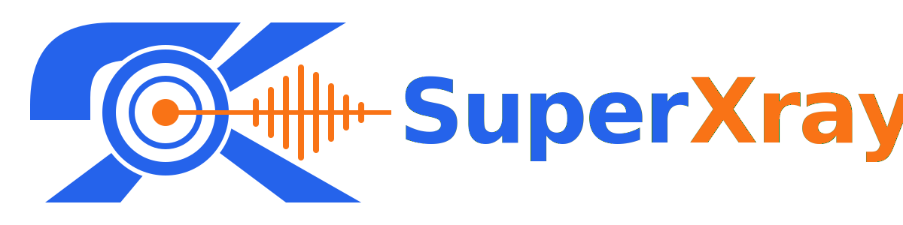

[English](/README.md) | [فارسی](/README.fa_IR.md) | [العربية](/README.ar_EG.md) | [中文](/README.zh_CN.md) | [Español](/README.es_ES.md) | [Русский](/README.ru_RU.md)

<p align="center">
  <picture>
    <source media="(prefers-color-scheme: dark)" srcset="./media/superxray.svg">
    
  </picture>
</p>

[](https://github.com/superaddmin/SuperXray-gui/releases)
[](https://github.com/superaddmin/SuperXray-gui/actions)
[](#)
[](https://github.com/superaddmin/SuperXray-gui/releases/latest)
[](https://www.gnu.org/licenses/gpl-3.0.en.html)
[](https://pkg.go.dev/github.com/superaddmin/SuperXray-gui/v2)
[](https://goreportcard.com/report/github.com/superaddmin/SuperXray-gui/v2)

**SuperXray** — یک پنل کنترل پیشرفته مبتنی بر وب با کد باز که برای مدیریت سرور Xray-core طراحی شده است. این پنل یک رابط کاربری آسان برای پیکربندی و نظارت بر پروتکل‌های مختلف VPN و پراکسی ارائه می‌دهد.

> [!IMPORTANT]
> این پروژه فقط برای استفاده شخصی و ارتباطات است، لطفاً از آن برای اهداف غیرقانونی استفاده نکنید، لطفاً از آن در محیط تولید استفاده نکنید.

به عنوان یک نسخه بهبود یافته از پروژه اصلی X-UI، SuperXray پایداری بهتر، پشتیبانی گسترده‌تر از پروتکل‌ها و ویژگی‌های اضافی را ارائه می‌دهد.

## شروع سریع

```bash
bash <(curl -Ls https://raw.githubusercontent.com/superaddmin/SuperXray-gui/main/install.sh)
```

برای نصب صریح نسخه فعلی:

```bash
bash <(curl -Ls https://raw.githubusercontent.com/superaddmin/SuperXray-gui/main/install.sh) v3.0.2
```

بسته‌های رسمی فعلاً برای Linux `amd64` و `arm64` منتشر می‌شوند. اسکریپت نصب در پایان نام کاربری، گذرواژه، پورت پنل و `webBasePath` تولیدشده را نمایش می‌دهد؛ این اطلاعات را ذخیره کنید. تصویر Docker با نام `ghcr.io/superaddmin/superxray-gui:3.0.2` در دسترس است. جزئیات Docker، نصب باینری و وابستگی‌ها را در [docs/deployment.md](docs/deployment.md) ببینید.

برای مستندات کامل، لطفاً به [ویکی پروژه](https://github.com/superaddmin/SuperXray-gui/wiki) مراجعه کنید.

## تشکر ویژه از

- [alireza0](https://github.com/alireza0/)

## قدردانی

- [Iran v2ray rules](https://github.com/chocolate4u/Iran-v2ray-rules) (مجوز: **GPL-3.0**): _قوانین مسیریابی بهبود یافته v2ray/xray و v2ray/xray-clients با دامنه‌های ایرانی داخلی و تمرکز بر امنیت و مسدود کردن تبلیغات._
- [Russia v2ray rules](https://github.com/runetfreedom/russia-v2ray-rules-dat) (مجوز: **GPL-3.0**): _این مخزن شامل قوانین مسیریابی V2Ray به‌روزرسانی شده خودکار بر اساس داده‌های دامنه‌ها و آدرس‌های مسدود شده در روسیه است._

## پشتیبانی از پروژه

**اگر این پروژه برای شما مفید است، می‌توانید به آن یک**:star2: بدهید

<a href="https://www.buymeacoffee.com/MHSanaei" target="_blank">

</a>

</br>
<a href="https://nowpayments.io/donation/hsanaei" target="_blank" rel="noreferrer noopener">
   
</a>

## ستاره‌ها در طول زمان

[](https://starchart.cc/superaddmin/SuperXray-gui)
