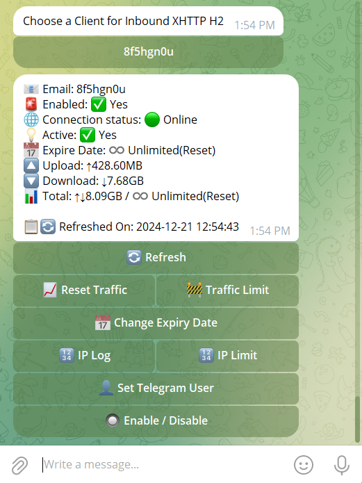

[English](/README.md) | [فارسی](/README.fa_IR.md) | [العربية](/README.ar_EG.md) | [中文](/README.zh_CN.md) | [Español](/README.es_ES.md) | [Русский](/README.ru_RU.md)

<p align="center">
  <picture>
    <source media="(prefers-color-scheme: dark)" srcset="./media/superxray.svg">
    
  </picture>
</p>

[](https://github.com/superaddmin/SuperXray-gui/releases)
[](https://github.com/superaddmin/SuperXray-gui/actions)
[](#)
[](https://github.com/superaddmin/SuperXray-gui/releases/latest)
[](https://www.gnu.org/licenses/gpl-3.0.en.html)
[](https://pkg.go.dev/github.com/superaddmin/SuperXray-gui/v2)
[](https://goreportcard.com/report/github.com/superaddmin/SuperXray-gui/v2)

**SuperXray** — advanced, open-source web-based control panel designed for managing Xray-core server. It offers a user-friendly interface for configuring and monitoring various VPN and proxy protocols.

> [!IMPORTANT]
> This project is only for personal usage, please do not use it for illegal purposes, and please do not use it in a production environment.

As an enhanced fork of the original X-UI project, SuperXray provides improved stability, broader protocol support, and additional features.

## Current Vue UI

The Vue 3 operations UI now centers the dashboard, inbound management, outbound tools, settings, and bot/integration pages. The screenshots below use the latest UI assets in `media/` and replace the older mixed references.

<table>
  <tr>
    <td>
      <picture>
        <source media="(prefers-color-scheme: dark)" srcset="./media/01-overview-dark.png">
        
      </picture>
    </td>
    <td>
      <picture>
        <source media="(prefers-color-scheme: dark)" srcset="./media/02-inbounds-dark.png">
        
      </picture>
    </td>
  </tr>
  <tr>
    <td align="center">Dashboard overview</td>
    <td align="center">Inbound list</td>
  </tr>
  <tr>
    <td>
      <picture>
        <source media="(prefers-color-scheme: dark)" srcset="./media/03-add-inbound-dark.png">
        
      </picture>
    </td>
    <td>
      <picture>
        <source media="(prefers-color-scheme: dark)" srcset="./media/04-add-client-dark.png">
        
      </picture>
    </td>
  </tr>
  <tr>
    <td align="center">Add inbound</td>
    <td align="center">Add client</td>
  </tr>
  <tr>
    <td>
      <picture>
        <source media="(prefers-color-scheme: dark)" srcset="./media/05-settings-dark.png">
        
      </picture>
    </td>
    <td>
      <picture>
        <source media="(prefers-color-scheme: dark)" srcset="./media/06-configs-dark.png">
        
      </picture>
    </td>
  </tr>
  <tr>
    <td align="center">Settings</td>
    <td align="center">Xray configuration and outbound tools</td>
  </tr>
  <tr>
    <td colspan="2" align="center">
      <picture>
        <source media="(prefers-color-scheme: dark)" srcset="./media/07-bot-dark.png">
        
      </picture>
    </td>
  </tr>
  <tr>
    <td colspan="2" align="center">Bot / integration setup</td>
  </tr>
</table>

### Inbound Setup Guide

1. Open the **Inbounds** page. It shows every listener, its protocol, transport, client count, traffic totals, and enable switch.
   <p align="center">
     
   </p>

2. Click **New Inbound** to open the create dialog. This form is where you define the protocol, remark, listen address, port, traffic limit, expiry, and enabled state.
   <p align="center">
     
   </p>

3. Choose the protocol first. Common proxy protocols such as VMess, VLESS, Trojan, Shadowsocks, Hysteria2, and WireGuard support client management and sharing. Tunnel, HTTP, Mixed, and Tun are valid Xray listeners, but they are not subscription nodes.

4. Fill in the listener fields:
   - `Listen` controls the bind address.
   - `Port` must be unique on the server.
   - `Traffic Limit GB`, `Expiry Timestamp`, and `Traffic Reset` are optional lifecycle controls.
   - `Enable` turns the inbound on immediately after saving.

5. If the protocol exposes stream settings, open the transport section and set the network, security, TLS, Reality, or protocol-specific fields. The form stays synchronized with the legacy Xray JSON template.

6. Save the inbound and open **Details** on the row you just created. The drawer shows live activity, online clients, traffic counters, and the share/export actions.

7. Add a client from the drawer or the row action menu. Set the email, traffic limit, expiry, and protocol-specific credentials, then save.
   <p align="center">
     
   </p>

8. Use **Share**, **Access**, **Reset**, and **Export** to generate share links, QR codes, subscription snippets, or JSON for external clients.

### Outbound Setup Guide

1. Open the **Xray** workspace from the main navigation. The page starts with the Gateway Egress MVP block, then outbound tools, structured outbounds, and routing rules.
   <p align="center">
     
   </p>

2. In **Outbound Tools**, use **Refresh Traffic** to inspect current counters and **Test First Outbound** to verify the active first outbound against the saved outbound test URL.

3. In **Residential IP Pool**, add or edit SOCKS5 outbounds when you need dedicated egress entries. These rows stay inside the existing Xray template and can be tested individually.

4. In **Outbounds**, add, reorder, edit, or delete outbound blocks in the template. Keep the first outbound aligned with the path you want to test most often.

5. In **Routing Rules**, map domains or inbound tags to the intended outbound tags. Use the structured editor to keep AI, residential, and general traffic separated.

6. If you only need a local Gateway entry, use the Gateway Egress MVP fields at the top of the Xray page. It generates Xray-compatible SOCKS5 inbounds and a CSV manifest, without creating new database models.

7. The MVP uses `listenHost` for the generated Xray inbound listen address and `manifestHost` for the Gateway CSV host rows, so Docker bridge deployments can register a Gateway-reachable address instead of a container-local loopback.

8. The current MVP keeps the existing Xray template save path as the only persistence path.

## Quick Start

### One-click install (Linux)

```bash
bash <(curl -Ls https://raw.githubusercontent.com/superaddmin/SuperXray-gui/main/install.sh)
```

To pin the current release:

```bash
bash <(curl -Ls https://raw.githubusercontent.com/superaddmin/SuperXray-gui/main/install.sh) v3.4.0
```

The installer prepares the required Linux packages (`cron`/`cronie`, `curl`, `tar`, `tzdata`, `socat`, `ca-certificates`, `openssl`), downloads the matching GitHub Release asset, and prints the generated username, password, panel port, and `webBasePath` at the end. Official binary assets are currently published for Linux `amd64` and `arm64`.

### Docker / GHCR

```bash
docker run -d --name superxray-gui --network host --restart unless-stopped \
  -v $PWD/db:/etc/x-ui \
  -v $PWD/cert:/root/cert \
  -e XRAY_VMESS_AEAD_FORCED=false \
  -e XUI_ENABLE_FAIL2BAN=true \
  ghcr.io/superaddmin/superxray-gui:3.4.0
```

The repository `docker-compose.yml` builds the image from local source. For image-based container deployment, you can switch Compose to `image: ghcr.io/superaddmin/superxray-gui:3.4.0`. Docker startup does not run the one-click installer's random security initialization, so change the default credentials, panel port, and `webBasePath` immediately after the first start.

For deployment details, see [docs/deployment.md](docs/deployment.md). For AI-platform routing through a dedicated residential egress, see [docs/ai-routing-and-residential-egress.md](docs/ai-routing-and-residential-egress.md). For the Xray-compatible Gateway egress MVP plan, see [docs/superpowers/plans/2026-05-16-vpn-egress-mvp-xray-compatible.md](docs/superpowers/plans/2026-05-16-vpn-egress-mvp-xray-compatible.md). For development and release workflow notes, see [docs/development.md](docs/development.md). The project Wiki remains available at <https://github.com/superaddmin/SuperXray-gui/wiki>.

## A Special Thanks to

- [alireza0](https://github.com/alireza0/)

## Acknowledgment

- [Iran v2ray rules](https://github.com/chocolate4u/Iran-v2ray-rules) (License: **GPL-3.0**): _Enhanced v2ray/xray and v2ray/xray-clients routing rules with built-in Iranian domains and a focus on security and adblocking._
- [Russia v2ray rules](https://github.com/runetfreedom/russia-v2ray-rules-dat) (License: **GPL-3.0**): _This repository contains automatically updated V2Ray routing rules based on data on blocked domains and addresses in Russia._

## Support project

**If this project is helpful to you, you may wish to give it a**:star2:

<a href="https://www.buymeacoffee.com/MHSanaei" target="_blank">

</a>

</br>
<a href="https://nowpayments.io/donation/hsanaei" target="_blank" rel="noreferrer noopener">
   
</a>

## Stargazers over Time

[](https://starchart.cc/superaddmin/SuperXray-gui)
