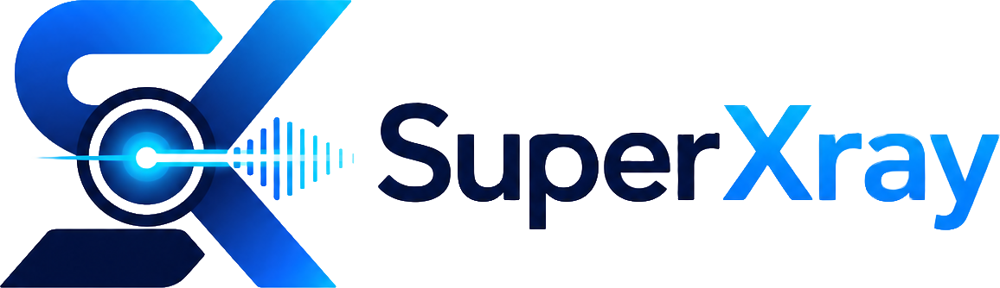
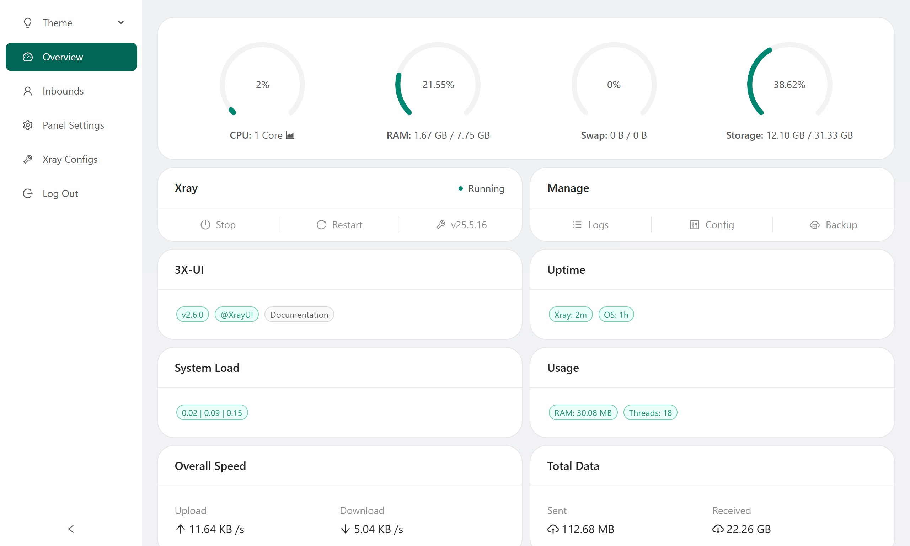
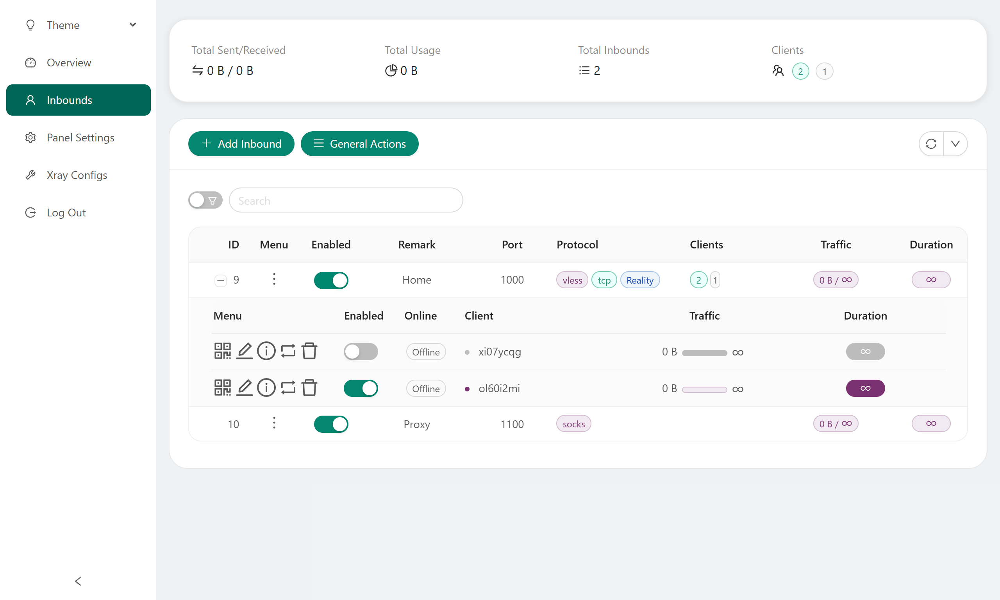
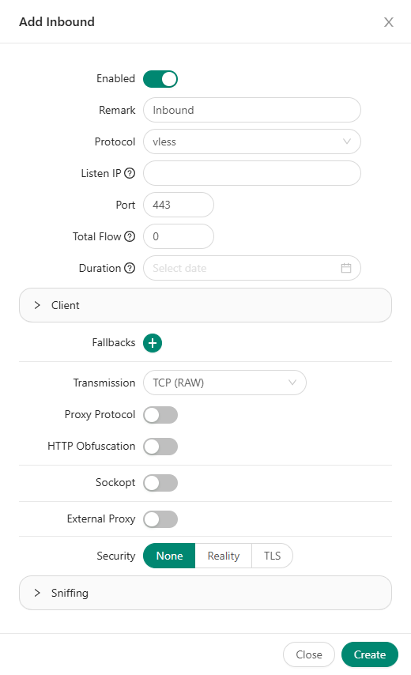
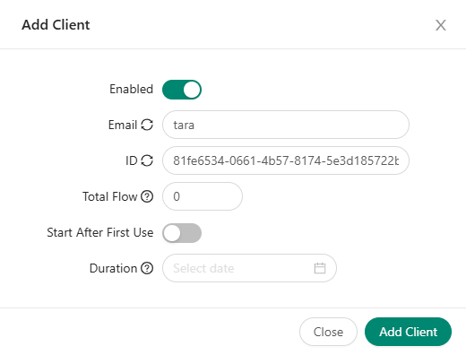
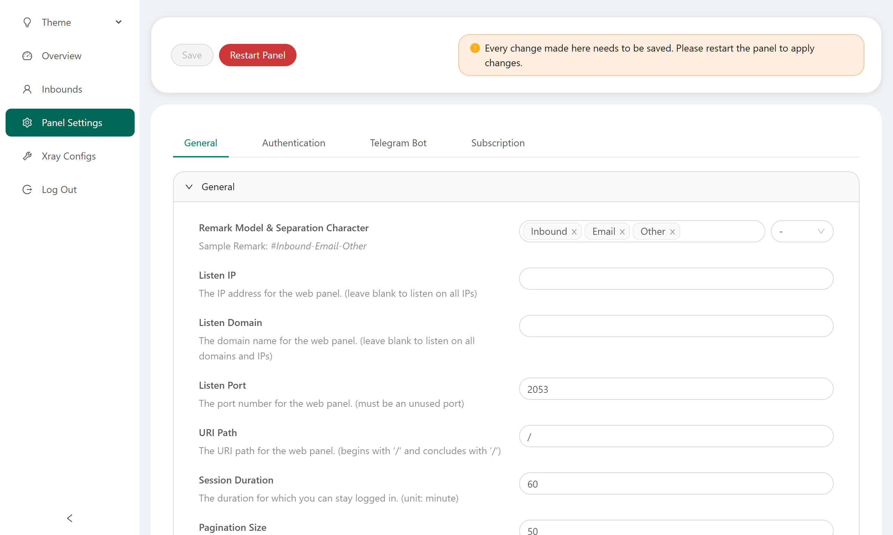
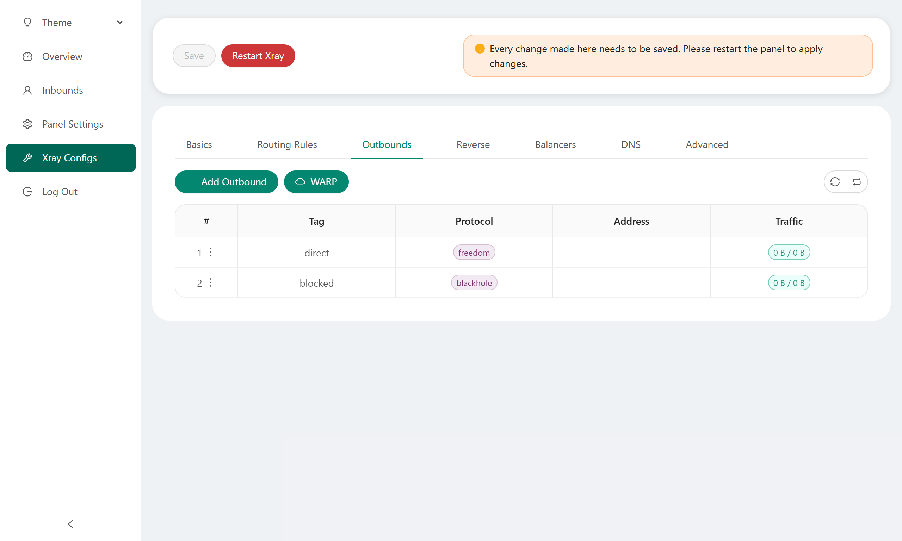

[English](/README.md) | [فارسی](/README.fa_IR.md) | [العربية](/README.ar_EG.md) | [中文](/README.zh_CN.md) | [Español](/README.es_ES.md) | [Русский](/README.ru_RU.md)

<p align="center">
  <picture>
    <source media="(prefers-color-scheme: dark)" srcset="./media/SuperXray.png">
    
  </picture>
</p>

[](https://github.com/superaddmin/SuperXray-gui/releases)
[](https://github.com/superaddmin/SuperXray-gui/actions)
[](#)
[](https://github.com/superaddmin/SuperXray-gui/releases/latest)
[](https://www.gnu.org/licenses/gpl-3.0.en.html)
[](https://pkg.go.dev/github.com/superaddmin/SuperXray-gui/v2)
[](https://goreportcard.com/report/github.com/superaddmin/SuperXray-gui/v2)

**SuperXray** — 一个基于网页的高级开源控制面板，专为管理 Xray-core 服务器而设计。它提供了用户友好的界面，用于配置和监控各种 VPN 和代理协议。

> [!IMPORTANT]
> 本项目仅用于个人使用和通信，请勿将其用于非法目的，请勿在生产环境中使用。

作为原始 X-UI 项目的增强版本，SuperXray 提供了更好的稳定性、更广泛的协议支持和额外的功能。

---

## 📋 目录

- [功能特性](#-功能特性)
- [截图预览](#-截图预览)
- [快速开始](#-快速开始)
- [安装方式](#-安装方式)
- [基本使用](#-基本使用)
- [技术栈](#-技术栈)
- [项目结构](#-项目结构)
- [本地开发](#-本地开发)
- [配置说明](#-配置说明)
- [技术文档](#-技术文档)
- [常见问题](#-常见问题)
- [致谢与支持](#-致谢与支持)
- [许可证](#-许可证)

---

## ✨ 功能特性

### 协议支持

| 协议 | 说明 |
|------|------|
| VMess | V2Ray 原生协议，支持 AES/ChaCha20 加密 |
| VLESS | 轻量级协议，支持 XTLS/Reality |
| Trojan | 基于 TLS 的协议 |
| Shadowsocks | 经典代理协议 |
| Hysteria (v1/v2) | 基于 QUIC 的高性能协议 |
| WireGuard | VPN 隧道协议 |
| HTTP / Socks | 代理协议 |
| Mixed | 混合代理（HTTP + Socks） |
| Dokodemo-door | 任意门（透明代理） |

### 核心功能

- 🖥️ **Web 管理面板**：直观的图形界面管理 Xray 服务器
- 👥 **客户端管理**：支持多客户端，独立流量限制、过期时间、IP 限制
- 📊 **实时监控**：流量统计、CPU/内存监控、WebSocket 实时推送
- 📱 **Telegram Bot**：通过 Bot 管理服务器、接收通知、自动备份
- 🔗 **订阅服务**：支持 Base64、JSON、Clash/Mihomo 三种订阅格式
- 🔐 **安全特性**：TOTP 双因素认证、LDAP 集成、fail2ban 防暴力破解
- 🌐 **国际化**：支持 13 种语言
- 🔄 **扩展集成**：Cloudflare WARP、NordVPN、自定义 GeoIP/GeoSite
- 🐳 **容器化**：完整的 Docker 支持，一键部署

---

## 📸 截图预览

<table>
  <tr>
    <td></td>
    <td></td>
  </tr>
  <tr>
    <td align="center">仪表盘</td>
    <td align="center">入站列表</td>
  </tr>
  <tr>
    <td></td>
    <td></td>
  </tr>
  <tr>
    <td align="center">添加入站</td>
    <td align="center">添加客户端</td>
  </tr>
  <tr>
    <td></td>
    <td></td>
  </tr>
  <tr>
    <td align="center">面板设置</td>
    <td align="center">Xray 配置</td>
  </tr>
</table>

---

## 🚀 快速开始

```bash
bash <(curl -Ls https://raw.githubusercontent.com/superaddmin/SuperXray-gui/main/install.sh)
```

安装完成后访问 `http://<服务器IP>:2053`，使用默认账号登录：

- **用户名**：`admin`
- **密码**：`admin`

> ⚠️ 请在首次登录后立即修改默认密码！

---

## 📦 安装方式

### 方式一：一键脚本安装（推荐）

```bash
bash <(curl -Ls https://raw.githubusercontent.com/superaddmin/SuperXray-gui/main/install.sh)
```

**支持的操作系统**：Ubuntu 16.04+、Debian 9+、CentOS 7+、Arch Linux、Alpine

**安装后管理命令**：

```bash
x-ui              # 打开管理菜单
x-ui start        # 启动服务
x-ui stop         # 停止服务
x-ui restart      # 重启服务
x-ui restart-xray # 仅重启 Xray
x-ui status       # 查看状态
x-ui update       # 更新面板
x-ui update-all-geofiles  # 更新 GeoIP/GeoSite 数据
```

### 方式二：Docker 安装

```bash
# 克隆仓库
git clone https://github.com/superaddmin/SuperXray-gui.git
cd SuperXray-gui

# 启动服务
docker compose up -d
```

**docker-compose.yml**：

```yaml
services:
  3xui:
    build:
      context: .
      dockerfile: ./Dockerfile
    container_name: 3xui_app
    volumes:
      - $PWD/db/:/etc/x-ui/       # 数据库持久化
      - $PWD/cert/:/root/cert/    # SSL 证书
    environment:
      XRAY_VMESS_AEAD_FORCED: "false"
      XUI_ENABLE_FAIL2BAN: "true"
    tty: true
    network_mode: host
    restart: unless-stopped
```

### 方式三：手动构建

```bash
# 克隆仓库
git clone https://github.com/superaddmin/SuperXray-gui.git
cd SuperXray-gui

# 编译（需要 Go 1.26+ 和 CGO）
CGO_ENABLED=1 go build -ldflags "-w -s" -o x-ui main.go

# 运行
./x-ui run
```

---

## 📖 基本使用

### 登录面板

1. 浏览器访问 `http://<服务器IP>:2053`
2. 输入用户名和密码登录
3. 建议在 **设置 → 面板设置** 中修改默认用户名和密码

### 添加入站（Inbound）

1. 进入 **入站列表** 页面
2. 点击 **添加入站**
3. 选择协议（如 VLESS、VMess、Trojan）
4. 配置端口、传输方式（TCP/WS/gRPC/HTTPUpgrade 等）
5. 配置 TLS/Reality 设置
6. 保存

### 客户端配置

1. 在入站中添加客户端
2. 设置客户端 Email、流量限制、过期时间
3. 点击客户端的操作按钮获取配置链接或二维码
4. 将配置导入到客户端应用

### 订阅链接

在面板设置中启用订阅服务后，每个客户端会自动生成订阅 ID，可通过以下地址获取配置：

| 格式 | 地址 | 适用客户端 |
|------|------|-----------|
| Base64 | `http://<IP>:2096/sub/<subid>` | V2rayN、Shadowrocket |
| JSON | `http://<IP>:2096/json/<subid>` | Xray 客户端 |
| Clash | `http://<IP>:2096/clash/<subid>` | Clash/Mihomo |

---

## 🛠 技术栈

### 后端

| 技术 | 版本 | 用途 |
|------|------|------|
| Go | 1.26.2 | 后端开发语言 |
| Gin | v1.12.0 | HTTP Web 框架 |
| GORM | v1.31.1 | ORM 框架 |
| SQLite | - | 嵌入式数据库 |
| Xray-core | v1.260327.0 | 代理核心引擎 |
| robfig/cron | v3.0.1 | 定时任务调度 |
| gorilla/websocket | - | WebSocket 通信 |
| telego | - | Telegram Bot API |
| gopsutil | v4 | 系统信息采集 |
| go-i18n | v2 | 国际化框架 |

### 前端

| 技术 | 用途 |
|------|------|
| Vue.js | 前端 MVVM 框架 |
| Ant Design Vue | UI 组件库 |
| Axios | HTTP 客户端 |
| CodeMirror | JSON 代码编辑器 |
| QRious | 二维码生成 |

### DevOps

| 工具 | 用途 |
|------|------|
| Docker | 容器化部署 |
| GitHub Actions | CI/CD 自动化 |
| CodeQL | 代码安全分析 |
| Dependabot | 依赖自动更新 |

---

## 📁 项目结构

```
SuperXray-gui/
├── main.go                    # 程序入口，CLI 命令解析
├── config/                    # 配置管理
│   ├── config.go              # 配置加载与环境变量
│   ├── version                # 版本号 (2.9.6)
│   └── name                   # 应用名 (x-ui)
├── database/                  # 数据库层
│   ├── db.go                  # SQLite 初始化与迁移
│   └── model/
│       ├── model.go           # 数据模型 (User/Inbound/Client/Setting)
│       └── model_test.go      # 模型测试
├── logger/                    # 日志系统
│   └── logger.go              # 双后端日志 (控制台 + 文件)
├── web/                       # Web 层 (核心)
│   ├── web.go                 # HTTP 服务器主体 (507 行)
│   ├── controller/            # 控制器层 (9 个文件)
│   │   ├── index.go           # 首页/登录/登出
│   │   ├── xui.go             # 面板页面路由
│   │   ├── api.go             # API 路由组入口
│   │   ├── inbound.go         # Inbound CRUD
│   │   ├── setting.go         # 面板设置
│   │   ├── xray_setting.go    # Xray 配置管理
│   │   ├── server.go          # 服务器管理
│   │   ├── websocket.go       # WebSocket 连接
│   │   └── custom_geo.go      # 自定义 Geo 资源
│   ├── service/               # 业务逻辑层 (14 个文件)
│   │   ├── inbound.go         # Inbound 服务 (2804 行)
│   │   ├── tgbot.go           # Telegram Bot (3823 行)
│   │   ├── server.go          # 服务器监控 (1329 行)
│   │   ├── setting.go         # 设置服务 (859 行)
│   │   ├── xray.go            # Xray 进程管理
│   │   ├── user.go            # 用户认证
│   │   └── ...                # 其他服务
│   ├── job/                   # 后台定时任务 (10 个 Job)
│   ├── websocket/             # WebSocket Hub
│   ├── middleware/            # 中间件 (域名验证/重定向)
│   ├── html/                  # HTML 模板
│   ├── assets/                # 静态资源 (JS/CSS/字体)
│   └── translation/           # 翻译文件 (13 种语言 TOML)
├── sub/                       # 订阅服务
│   ├── sub.go                 # 订阅服务器主体
│   ├── subService.go          # Base64 订阅 (1484 行)
│   ├── subJsonService.go      # JSON 订阅
│   └── subClashService.go     # Clash/Mihomo 订阅
├── util/                      # 工具包
│   ├── crypto/                # bcrypt 密码哈希
│   ├── ldap/                  # LDAP 认证
│   ├── random/                # 随机数生成
│   └── sys/                   # 系统信息 (跨平台)
├── xray/                      # Xray 集成包
├── media/                     # 截图与资源图片
├── docs/                      # 技术文档
│   ├── architecture.md        # 系统架构设计
│   ├── deployment.md          # 部署指南
│   ├── modules.md             # 核心模块解析
│   ├── api.md                 # API 接口说明
│   └── development.md         # 开发者贡献指南
├── Dockerfile                 # 多阶段 Docker 构建
├── docker-compose.yml         # Docker Compose 编排
├── install.sh                 # 一键安装脚本
└── .github/                   # CI/CD 配置
```

---

## 💻 本地开发

### 环境准备

```bash
# 安装 Go 1.26+
go version

# 克隆仓库
git clone https://github.com/superaddmin/SuperXray-gui.git
cd SuperXray-gui
```

### 运行调试

```bash
# 1. 创建数据目录
mkdir -p x-ui

# 2. 配置环境变量
cp .env.example .env

# 3. 调试模式运行（支持模板热更新）
XUI_DEBUG=true go run main.go
```

### 编译构建

```bash
# 标准编译
CGO_ENABLED=1 go build -ldflags "-w -s" -o x-ui main.go

# Docker 构建
docker build -t superxray-gui .
```

### 运行测试

```bash
# 运行所有测试
go test ./...

# 查看详细输出
go test -v ./...

# 生成覆盖率报告
go test -cover ./...
```

> 💡 详细的开发指南请参阅 [开发者贡献指南](docs/development.md)。

---

## ⚙️ 配置说明

### 环境变量

| 变量 | 默认值 | 说明 |
|------|--------|------|
| `XUI_DEBUG` | `false` | 启用调试模式 |
| `XUI_LOG_LEVEL` | `info` | 日志级别 (debug/info/warning/error) |
| `XUI_DB_FOLDER` | `x-ui` | 数据库文件目录 |
| `XUI_LOG_FOLDER` | `x-ui` | 日志文件目录 |
| `XUI_BIN_FOLDER` | `x-ui` | 二进制文件目录 |

### CLI 命令

```bash
x-ui run                                    # 运行面板
x-ui setting -show                          # 显示当前设置
x-ui setting -port 2053                     # 设置端口
x-ui setting -username admin -password xxx  # 设置用户名和密码
x-ui setting -webCert /path/cert.pem        # 设置 SSL 证书
x-ui setting -tgbottoken TOKEN              # 设置 TG Bot Token
x-ui setting -enabletgbot true              # 启用 TG Bot
x-ui cert -reset                            # 重置证书
x-ui migrate                                # 数据库迁移
```

### 面板设置

登录面板后，在 **设置** 页面可配置：

- **面板设置**：端口、监听 IP、SSL 证书、根路径、Session 过期时间
- **订阅设置**：启用订阅、端口、路径、加密、更新间隔
- **Telegram Bot**：Token、管理员 ID、代理、统计报告频率
- **安全设置**：双因素认证
- **LDAP 设置**：LDAP 服务器、绑定 DN、同步频率

---

## 📚 技术文档

完整的技术文档位于 [`docs/`](docs/) 目录：

| 文档 | 说明 |
|------|------|
| [系统架构设计](docs/architecture.md) | 整体架构、数据流、安全设计、实时通信架构 |
| [部署指南](docs/deployment.md) | Docker/脚本/手动部署、反向代理、故障排查 |
| [核心模块解析](docs/modules.md) | 每个模块的详细分析、关键代码路径 |
| [API 接口说明](docs/api.md) | 完整的 REST API 文档、请求/响应示例 |
| [开发者贡献指南](docs/development.md) | 开发环境搭建、代码规范、测试、CI/CD |

更多使用说明请参阅 [项目 Wiki](https://github.com/superaddmin/SuperXray-gui/wiki)。

---

## ❓ 常见问题

<details>
<summary><strong>如何修改面板端口？</strong></summary>

```bash
x-ui setting -port 新端口号
x-ui restart
```

或在面板 **设置 → 面板设置** 中修改。

</details>

<details>
<summary><strong>如何配置 SSL 证书？</strong></summary>

方式一：通过 CLI
```bash
x-ui cert -webCert /path/to/cert.pem -webCertKey /path/to/key.pem
```

方式二：通过面板 **设置 → 面板设置** 中配置证书路径。

</details>

<details>
<summary><strong>如何设置 Telegram Bot？</strong></summary>

1. 通过 [@BotFather](https://t.me/botfather) 创建 Bot 并获取 Token
2. 获取你的 Chat ID（可通过 [@userinfobot](https://t.me/userinfobot)）
3. 在面板 **设置 → Telegram Bot 设置** 中填入 Token 和 Chat ID
4. 启用 Bot

</details>

<details>
<summary><strong>如何备份数据？</strong></summary>

```bash
# 手动备份
cp /etc/x-ui/x-ui.db /backup/x-ui-$(date +%Y%m%d).db

# 通过 TG Bot 自动备份
# 在面板设置中启用 TG Bot 自动备份
```

</details>

<details>
<summary><strong>Xray 启动失败怎么办？</strong></summary>

1. 在面板中查看 Xray 日志（Xray 配置页面 → 日志）
2. 检查端口是否被占用：`ss -tlnp | grep <端口号>`
3. 检查配置文件格式是否正确
4. 尝试重启 Xray：面板首页 → 重启 Xray

</details>

---

## 🙏 致谢与支持

### 特别感谢

- [alireza0](https://github.com/alireza0/) — 原 X-UI 项目贡献者

### 致谢

- [Iran v2ray rules](https://github.com/chocolate4u/Iran-v2ray-rules) (许可证: **GPL-3.0**): _增强的 v2ray/xray 路由规则，内置伊朗域名，专注于安全性和广告拦截。_
- [Russia v2ray rules](https://github.com/runetfreedom/russia-v2ray-rules-dat) (许可证: **GPL-3.0**): _基于俄罗斯被阻止域名数据自动更新的 V2Ray 路由规则。_

### 支持项目

**如果这个项目对您有帮助，您可以给它一个** ⭐2

<a href="https://www.buymeacoffee.com/MHSanaei" target="_blank">

</a>

</br>
<a href="https://nowpayments.io/donation/hsanaei" target="_blank" rel="noreferrer noopener">
   
</a>

---

## 📄 许可证

本项目基于 [GPL V3](https://www.gnu.org/licenses/gpl-3.0.en.html) 许可证开源。

---

## Stargazers over Time

[](https://starchart.cc/superaddmin/SuperXray-gui)
