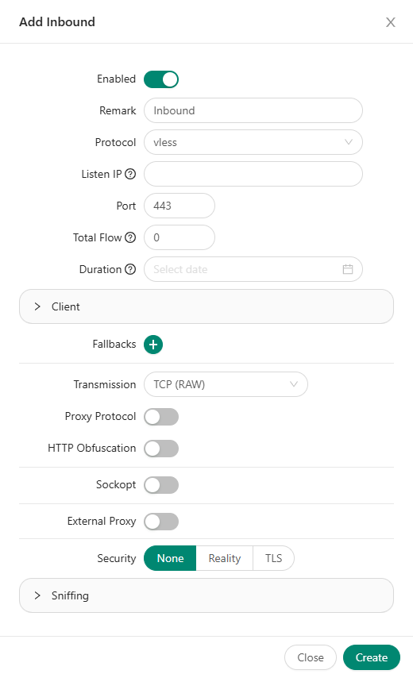
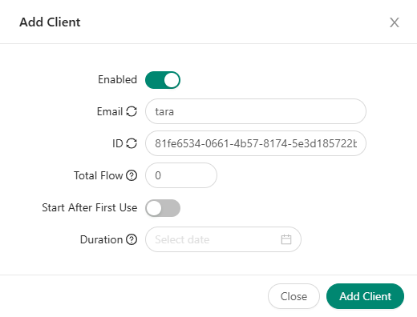
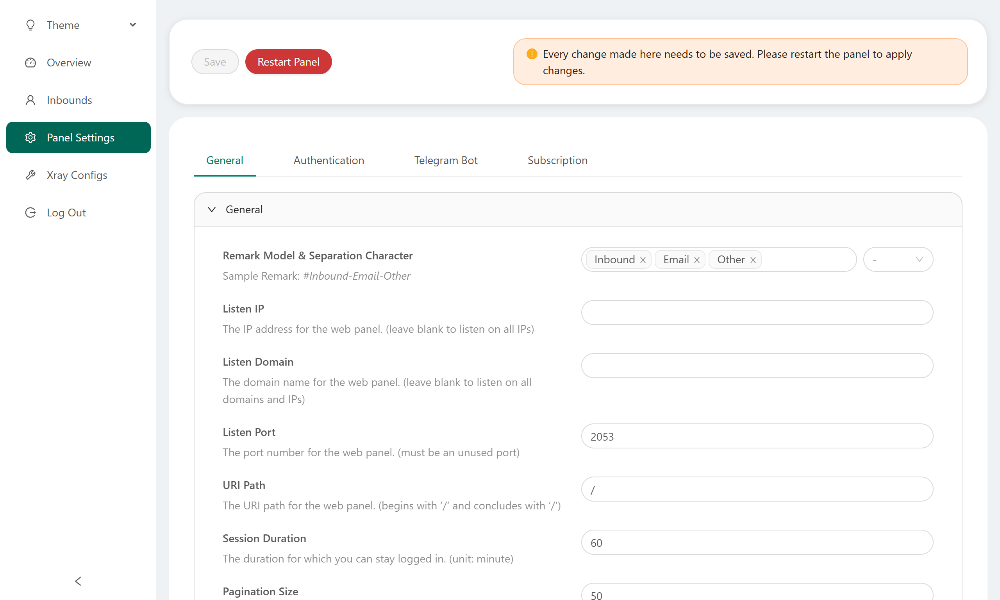
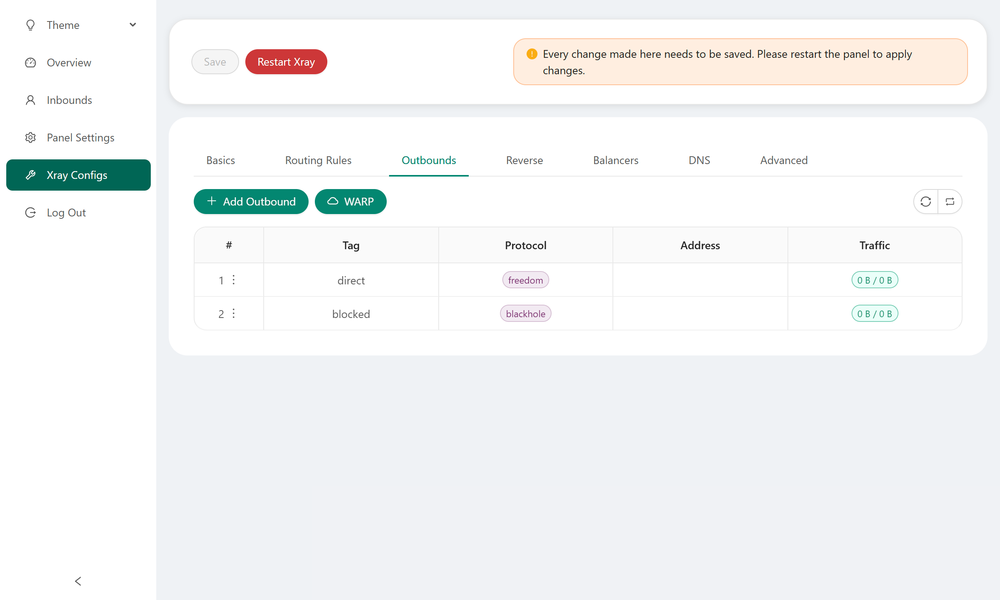
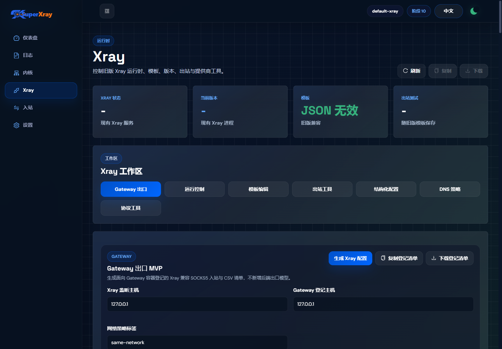
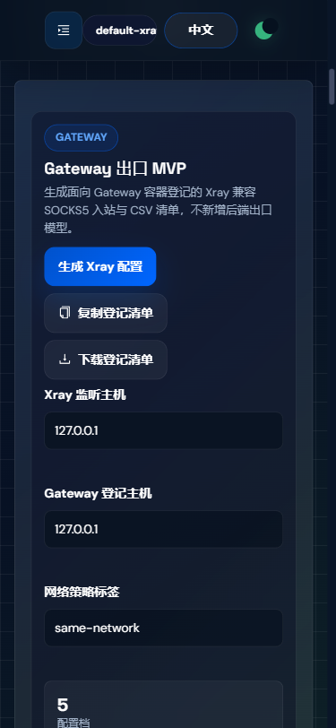

[English](/README.md) | [فارسی](/README.fa_IR.md) | [العربية](/README.ar_EG.md) | [中文](/README.zh_CN.md) | [Español](/README.es_ES.md) | [Русский](/README.ru_RU.md)

<p align="center">
  <picture>
    <source media="(prefers-color-scheme: dark)" srcset="./media/superxray.svg">
    
  </picture>
</p>

[](https://github.com/superaddmin/SuperXray-gui/releases)
[](https://github.com/superaddmin/SuperXray-gui/actions)
[](#)
[](https://github.com/superaddmin/SuperXray-gui/releases/latest)
[](https://www.gnu.org/licenses/gpl-3.0.en.html)
[](https://pkg.go.dev/github.com/superaddmin/SuperXray-gui/v2)
[](https://goreportcard.com/report/github.com/superaddmin/SuperXray-gui/v2)

**SuperXray** — 一个基于网页的高级开源控制面板，专为管理 Xray-core 服务器而设计。它提供了用户友好的界面，用于配置和监控各种 VPN 和代理协议。

> [!IMPORTANT]
> 本项目仅用于个人使用和通信，请勿将其用于非法目的，请勿在生产环境中使用。

作为原始 X-UI 项目的增强版本，SuperXray 提供了更好的稳定性、更广泛的协议支持和额外的功能。

---

## 📋 目录

- [功能特性](#-功能特性)
- [截图预览](#-截图预览)
- [快速开始](#-快速开始)
- [安装方式](#-安装方式)
- [基本使用](#-基本使用)
- [技术栈](#-技术栈)
- [项目结构](#-项目结构)
- [本地开发](#-本地开发)
- [配置说明](#-配置说明)
- [技术文档](#-技术文档)
- [常见问题](#-常见问题)
- [致谢与支持](#-致谢与支持)
- [许可证](#-许可证)

---

## ✨ 功能特性

### 协议支持

| 协议 | 说明 |
|------|------|
| VMess | V2Ray 原生协议，支持 AES/ChaCha20 加密 |
| VLESS | 轻量级协议，支持 XTLS/Reality |
| Trojan | 基于 TLS 的协议 |
| Shadowsocks | 经典代理协议 |
| Hysteria (v1/v2) | 基于 QUIC 的高性能协议 |
| WireGuard | VPN 隧道协议 |
| HTTP / Socks | 代理协议 |
| Mixed | 混合代理（HTTP + Socks） |
| Dokodemo-door | 任意门（透明代理） |

### 核心功能

- 🖥️ **Web 管理面板**：直观的图形界面管理 Xray 服务器
- 👥 **客户端管理**：支持多客户端，独立流量限制、过期时间、IP 限制
- 📊 **实时监控**：流量统计、CPU/内存监控、WebSocket 实时推送
- 📱 **Telegram Bot**：通过 Bot 管理服务器、接收通知、自动备份
- 🔗 **订阅服务**：支持 Base64、JSON、Clash/Mihomo 三种订阅格式，入站列表可导出单入站或全量订阅链接
- 🔐 **安全特性**：TOTP 双因素认证、LDAP 集成、fail2ban 防暴力破解
- 🌐 **国际化**：支持 13 种语言
- 🔄 **扩展集成**：Cloudflare WARP、NordVPN、自定义 GeoIP/GeoSite、Xray 出站健康检测与域名级智能分流配置
- 🧭 **Gateway 出口 MVP**：新 UI 的 Xray 工作区提供 Gateway 出口入口，可生成 Xray 兼容 SOCKS5 入站与 CSV 登记清单，区分 `listenHost` 与 `manifestHost`
- 🐳 **容器化**：完整的 Docker 支持，一键部署

---

## 📸 截图预览

<table>
  <tr>
    <td></td>
    <td></td>
  </tr>
  <tr>
    <td align="center">仪表盘</td>
    <td align="center">入站列表</td>
  </tr>
  <tr>
    <td></td>
    <td></td>
  </tr>
  <tr>
    <td align="center">添加入站</td>
    <td align="center">添加客户端</td>
  </tr>
  <tr>
    <td></td>
    <td></td>
  </tr>
  <tr>
    <td align="center">面板设置</td>
    <td align="center">Xray 配置</td>
  </tr>
  <tr>
    <td></td>
    <td></td>
  </tr>
  <tr>
    <td align="center">新 UI：Xray 工作区与 Gateway 出口 MVP</td>
    <td align="center">移动端 Gateway 出口表单</td>
  </tr>
</table>

---

## 🚀 快速开始

```bash
bash <(curl -Ls https://raw.githubusercontent.com/superaddmin/SuperXray-gui/main/install.sh)
```

如需固定安装当前版本：

```bash
bash <(curl -Ls https://raw.githubusercontent.com/superaddmin/SuperXray-gui/main/install.sh) v3.4.2
```

一键脚本会自动安装基础依赖，下载匹配架构的 GitHub Release 包，并在安装结束时输出随机生成的用户名、密码、面板端口和 `webBasePath`。这段输出只出现一次，请保存到密码管理器。当前官方 Release 二进制包覆盖 Linux `amd64` 与 `arm64`。

---

## 📦 安装方式

### 方式一：一键脚本安装（推荐）

```bash
bash <(curl -Ls https://raw.githubusercontent.com/superaddmin/SuperXray-gui/main/install.sh)
```

**支持的操作系统**：Ubuntu 16.04+、Debian 9+、CentOS 7+、Arch Linux、Alpine

**脚本会安装的基础依赖**：`cron` / `cronie` / `dcron`、`curl`、`tar`、`tzdata`、`socat`、`ca-certificates`、`openssl`。不同发行版的包名略有差异，详见 [部署指南](docs/deployment.md)。

**安装后的安全信息**：脚本检测到默认账号、默认路径或未配置证书时，会引导生成随机用户名、强密码、随机端口、随机 `webBasePath` 并配置 SSL。请以终端最终输出的访问地址为准，不要假设固定端口或固定账号。

**安装后管理命令**：

```bash
x-ui              # 打开管理菜单
x-ui start        # 启动服务
x-ui stop         # 停止服务
x-ui restart      # 重启服务
x-ui restart-xray # 仅重启 Xray
x-ui status       # 查看状态
x-ui update       # 更新面板
x-ui update-all-geofiles  # 更新 GeoIP/GeoSite 数据
```

### 方式二：Docker 安装

使用已发布的 GHCR 镜像：

```bash
docker run -d --name superxray-gui --network host --restart unless-stopped \
  -v $PWD/db:/etc/x-ui \
  -v $PWD/cert:/root/cert \
  -e XRAY_VMESS_AEAD_FORCED=false \
  -e XUI_ENABLE_FAIL2BAN=true \
  ghcr.io/superaddmin/superxray-gui:3.4.2
```

如果需要基于本地源码构建：

```bash
# 克隆仓库
git clone https://github.com/superaddmin/SuperXray-gui.git
cd SuperXray-gui

# 启动服务
docker compose up -d
```

**docker-compose.yml**：

```yaml
services:
  3xui:
    build:
      context: .
      dockerfile: ./Dockerfile
    container_name: 3xui_app
    volumes:
      - $PWD/db/:/etc/x-ui/       # 数据库持久化
      - $PWD/cert/:/root/cert/    # SSL 证书
    environment:
      XRAY_VMESS_AEAD_FORCED: "false"
      XUI_ENABLE_FAIL2BAN: "true"
    tty: true
    network_mode: host
    restart: unless-stopped
```

> Docker 入口不会执行一键脚本的随机化安全初始化。首次启动后请立即使用 `/app/x-ui setting ...` 修改默认用户名、密码、端口和 `webBasePath`，并配置证书；`docker run` 示例容器名是 `superxray-gui`，Compose 示例容器名是 `3xui_app`。

### 方式三：手动构建

```bash
# 克隆仓库
git clone https://github.com/superaddmin/SuperXray-gui.git
cd SuperXray-gui

# 编译（需要 Go 1.26.4 和 CGO）
CGO_ENABLED=1 go build -ldflags "-w -s" -o x-ui main.go

# 运行
./x-ui run
```

源码构建还需要系统提供 C 编译工具链（如 `gcc` / `build-essential` / `pkg-config`）。如需部署完整运行目录，请运行 `DockerInit.sh <amd64|arm64>` 下载 Xray-core 与 GeoIP/GeoSite 数据文件，或直接使用 GitHub Release 中的 `x-ui-linux-amd64.tar.gz` / `x-ui-linux-arm64.tar.gz`。

---

## 📖 基本使用

### 登录面板

1. 一键脚本部署时，浏览器访问安装结束输出的 `https://<域名或IP>:<端口>/<webBasePath>`。
2. Docker 或源码调试启动时，若尚未手动修改配置，默认端口通常为 `2053`，默认路径为 `/`。
3. 输入用户名和密码登录，并在 **设置 → 面板设置** 中确认端口、证书、根路径和安全选项。

### 添加入站（Inbound）

1. 进入 **入站列表** 页面
2. 点击 **添加入站**
3. 选择协议（如 VLESS、VMess、Trojan）
4. 配置端口、传输方式（TCP/WS/gRPC/HTTPUpgrade 等）
5. 配置 TLS/Reality 设置
6. 保存

### 客户端配置

1. 在入站中添加客户端
2. 设置客户端 Email、流量限制、过期时间
3. 点击客户端的操作按钮获取配置链接或二维码
4. 将配置导入到客户端应用

### 订阅链接

在面板设置中启用订阅服务后，标准协议客户端以及 HTTP/Mixed 代理账号可通过各自的订阅 ID 获取配置：

| 格式 | 地址 | 适用客户端 | 当前支持的协议 |
|------|------|-----------|----------------|
| Base64 / Plain URI | `http://<IP>:2096/sub/<subid>` | V2rayN、Shadowrocket、支持标准分享链接的客户端 | VMess、VLESS、Trojan、Shadowsocks、Hysteria、Hysteria2；HTTP 输出 HTTP proxy URI，Mixed 输出 SOCKS5 URI；WireGuard 返回独立配置文本 |
| JSON | `http://<IP>:2096/json/<subid>` | Xray 客户端 | VMess、VLESS、Trojan、Shadowsocks、Hysteria、Hysteria2、WireGuard；HTTP 生成 `protocol: http` outbound，Mixed 生成 `protocol: socks` outbound |
| Clash | `http://<IP>:2096/clash/<subid>` | Clash/Mihomo | VMess、VLESS、Trojan、Shadowsocks、Hysteria、Hysteria2、WireGuard；HTTP 生成 `type: http` 节点，Mixed 生成 `type: socks5` 节点 |

> HTTP/Mixed 账号节点覆盖三类入口：Base64 / Plain URI 分别生成 `http://` / `socks5://` URI；JSON 分别生成 `protocol: http` / `protocol: socks` outbound；Clash 分别生成 `type: http` / `type: socks5` 节点。认证账号读取自入站 `settings.accounts`，并按启用状态和有效订阅 ID 匹配。Tunnel 与 Tun 不生成客户端订阅节点。Clash/Mihomo 输出中，其他普通代理协议当前仅生成 TCP、WebSocket、gRPC 传输节点，mKCP、HTTPUpgrade、XHTTP 等传输更适合通过 Xray JSON 或客户端手动配置验证。
>
> 默认订阅服务监听 `2096/tcp`，提供 `/sub/`、`/json/`、`/clash/` 三类入口。若直接从公网访问订阅链接，需要在云安全组和系统防火墙放行 `2096/tcp`；更推荐通过 Nginx/Caddy 将订阅路径反向代理到统一的 `443/tcp`。

### Gateway 出口 MVP

新 UI 的 **Xray** 页面已经将 **Gateway 出口 MVP** 前置到模板编辑器之前。该入口只生成 Xray 兼容配置和 Gateway CSV 登记清单，不新增数据库模型、不接管 CoreManager、不触碰 sing-box 生产路径。

- `listenHost` 写入 Xray 生成入站的监听地址。
- `manifestHost` 写入 Gateway CSV 的 `host` 字段；Gateway 运行在 Docker 容器内时，不应把容器内不可达的 `127.0.0.1` 直接登记给 Gateway。
- 当前 MVP 固定生成 OpenAI、Anthropic、Gemini、US、JP 五个本机 SOCKS5 出口端口，并通过旧版 Xray 模板保存路径应用。

### 入站协议能力矩阵

| 入站协议 | 后端入站配置 | 保存校验强度 | 新 UI 编辑 | 订阅分发 | 运行状态说明 |
|----------|--------------|--------------|------------|----------|--------------|
| VMess | 支持 | UUID 校验 | 支持 | 支持 Base64/JSON/Clash | 主路径完整，属于可正常运行协议 |
| VLESS | 支持 | UUID 与 flow/TLS 约束校验 | 支持 | 支持 Base64/JSON/Clash | 主路径完整，Reality/XTLS 参数需与客户端能力匹配 |
| Trojan | 支持 | password 必填校验 | 支持 | 支持 Base64/JSON/Clash | 主路径完整，TLS 参数需按客户端要求配置 |
| Shadowsocks | 支持 | method/password/client 约束校验 | 支持 | 支持 Base64/JSON/Clash | 主路径完整，需选择客户端兼容的加密方法 |
| Hysteria | 支持 | auth 必填且要求 TLS | 支持 | 支持 Base64/JSON/Clash | 主路径完整，依赖客户端 Hysteria v1 支持 |
| Hysteria2 | 支持 | auth 必填且要求 TLS | 支持 | 支持 Base64/JSON/Clash | 主路径完整，依赖客户端 Hysteria2 支持 |
| WireGuard | 支持 | 基础字段透传，订阅侧按 peer 输出 | 支持 | 支持 WireGuard 配置、JSON、Clash | 可运行，客户端导入方式与普通代理协议不同 |
| Tunnel | 支持 | 后端轻校验，主要依赖 Xray 运行时校验 | 支持 | 不支持 | 可作为入站规则保存和运行，不生成客户端订阅节点 |
| HTTP | 支持 | 后端轻校验，主要依赖 Xray 运行时校验 | 支持 | 支持 Base64/Plain URI、JSON、Clash | URI 为 `http://`；JSON 为 `protocol: http` outbound；Clash 为 `type: http`；账号来自 `settings.accounts` |
| Mixed | 支持 | 后端轻校验，主要依赖 Xray 运行时校验 | 支持 | 支持 Base64/Plain URI、JSON、Clash | URI 为 `socks5://`；JSON 为 `protocol: socks` outbound；Clash 为 `type: socks5`；账号来自 `settings.accounts` |
| Tun | 支持 | 后端轻校验，主要依赖 Xray 运行时校验 | 支持 | 不支持 | 可作为透明代理类入站，运行效果依赖系统路由/权限配置 |

---

## 🛠 技术栈

### 后端

| 技术 | 版本 | 用途 |
|------|------|------|
| Go | 1.26.4 | 后端开发语言 |
| Gin | v1.12.0 | HTTP Web 框架 |
| GORM | v1.31.1 | ORM 框架 |
| SQLite | - | 嵌入式数据库 |
| Xray-core | v26.3.27 | 代理核心引擎 |
| robfig/cron | v3.0.x | 定时任务调度 |
| gorilla/websocket | - | WebSocket 通信 |
| telego | - | Telegram Bot API |
| gopsutil | v4 | 系统信息采集 |
| go-i18n | v2 | 国际化框架 |

### 前端

| 技术 | 版本 | 用途 |
|------|------|------|
| Vue | 3.5 | 组件与响应式 UI |
| Vite | 8.0 | 开发服务器与生产构建 |
| TypeScript | 6.0 | 类型系统 |
| Pinia | 3.0 | 前端状态管理 |
| Vue Router | 4.6 | 面板路由 |
| Ant Design Vue | 4.2 | UI 组件库 |
| Axios | 1.16 | HTTP 客户端 |

### DevOps

| 工具 | 用途 |
|------|------|
| Docker | 容器化部署 |
| GitHub Actions | CI/CD 自动化 |
| CodeQL | 代码安全分析 |
| Dependabot | 依赖自动更新 |

---

## 📁 项目结构

```text
SuperXray-gui/
├── main.go                    # CLI 与服务入口
├── config/                    # 版本、名称、环境与路径配置
├── core/                      # CoreManager 类型、注册表与实验适配器
├── database/                  # GORM/SQLite 初始化、模型与迁移
├── frontend/                  # Vue 3/Vite/TypeScript 源码与前端测试
│   ├── src/                   # 页面、组件、API、状态与兼容逻辑
│   ├── tests/                 # Node test runner 单元测试
│   ├── package.json           # 前端依赖与命令
│   └── vite.config.ts         # 构建输出到 ../web/ui
├── web/                       # Gin 面板、API 与 Go 托管的新 UI
│   ├── web.go                 # HTTP 服务、任务与生命周期
│   ├── ui.go                  # 嵌入 web/ui、注入 runtime config、注册路由
│   ├── controller/            # HTTP/API 控制器
│   ├── service/               # 业务服务
│   ├── job/                   # 后台定时任务
│   ├── middleware/            # 安全与请求中间件
│   ├── session/               # 登录会话与 CSRF
│   ├── websocket/             # WebSocket Hub
│   ├── translation/           # 服务端翻译文件
│   └── ui/                    # Vite 生产构建产物，供 go:embed 使用
├── sub/                       # URI/JSON/Clash/WireGuard 订阅服务
├── xray/                      # Xray 进程与 gRPC API 集成
├── util/                      # 通用工具
├── tools/                     # OpenAPI 等生成工具
├── scripts/                   # 仓库校验与维护脚本
├── docs/                      # 架构、API、部署和开发文档
├── Dockerfile                 # 容器构建
├── docker-compose.yml         # Docker Compose 编排
├── install.sh / update.sh     # 安装与更新脚本
└── .github/                   # CI/CD 与协作配置
```

新 UI 的事实源是 `frontend/src`；`npm run build` 会生成 `web/ui`，再由 `web/ui.go` 嵌入并挂载到 `/panel/`（兼容 `/panel/ui/`）。旧 `web/html`、`web/assets` 和 `/panel/legacy*` 已退役。

---

## 💻 本地开发

### 环境准备

```bash
# 安装 Go 1.26.4
go version

# 克隆仓库
git clone https://github.com/superaddmin/SuperXray-gui.git
cd SuperXray-gui

# 安装前端依赖
cd frontend
npm ci
cd ..
```

### 运行调试

```bash
# 1. 创建数据目录
mkdir -p x-ui

# 2. 配置环境变量
cp .env.example .env

# 3. 启动 Go 后端
XUI_DEBUG=true go run main.go
```

Vue 页面热更新由 Vite 提供，请在另一个终端运行：

```bash
cd frontend
npm run dev
```

### 编译构建

```bash
# 先构建 Vue UI（生成 web/ui）
cd frontend
npm run build
cd ..

# 再构建 Go 二进制
CGO_ENABLED=1 go build -ldflags "-w -s" -o x-ui main.go

# Docker 构建
docker build -t superxray-gui .
docker build -t ghcr.io/superaddmin/superxray-gui:dev .
```

### 运行测试

安装 npm 依赖后，`node_modules` 可能包含第三方 Go 示例包；全量验证先保留 `go list` 的失败状态，再用 Bash 数组过滤这些导入路径，避免测试范围漂移。

```bash
# 后端验证
go_package_output="$(go list ./...)" || exit 1
go_packages=()
while IFS= read -r package; do
  if [[ -n "$package" && "$package" != */node_modules/* ]]; then
    go_packages+=("$package")
  fi
done <<< "$go_package_output"

if ((${#go_packages[@]} == 0)); then
  echo "未找到项目 Go 包" >&2
  exit 1
fi

go test "${go_packages[@]}" || exit 1
go vet "${go_packages[@]}" || exit 1

# 前端验证
cd frontend
npm run typecheck
npm run lint
npm run test
npm run build
cd ..

# 秘密扫描
python scripts/secret_scan.py
```

> 💡 详细的开发指南请参阅 [开发者贡献指南](docs/development.md)。

---

## ⚙️ 配置说明

### 环境变量

| 变量 | 默认值 | 说明 |
|------|--------|------|
| `XUI_DEBUG` | `false` | 启用调试模式 |
| `XUI_LOG_LEVEL` | `info` | 日志级别 (debug/info/warning/error) |
| `XUI_DB_FOLDER` | `x-ui` | 数据库文件目录 |
| `XUI_LOG_FOLDER` | `x-ui` | 日志文件目录 |
| `XUI_BIN_FOLDER` | `x-ui` | 二进制文件目录 |

### CLI 命令

```bash
x-ui run                                    # 运行面板
x-ui setting -show                          # 显示当前设置
x-ui setting -port 2053                     # 设置端口
x-ui setting -username admin -password xxx  # 设置用户名和密码
x-ui setting -webCert /path/cert.pem        # 设置 SSL 证书
x-ui setting -tgbottoken TOKEN              # 设置 TG Bot Token
x-ui setting -enabletgbot true              # 启用 TG Bot
x-ui cert -reset                            # 重置证书
x-ui migrate                                # 数据库迁移
```

### 面板设置

登录面板后，在 **设置** 页面可配置：

- **面板设置**：端口、监听 IP、SSL 证书、根路径、Session 过期时间
- **订阅设置**：启用订阅、端口、路径、加密、更新间隔
- **Telegram Bot**：Token、管理员 ID、代理、统计报告频率
- **安全设置**：双因素认证
- **LDAP 设置**：LDAP 服务器、绑定 DN、同步频率

---

## 📚 技术文档

完整的技术文档位于 [`docs/`](docs/) 目录：

| 文档 | 说明 |
|------|------|
| [系统架构设计](docs/architecture.md) | 整体架构、数据流、安全设计、实时通信架构 |
| [部署指南](docs/deployment.md) | Docker/脚本/手动部署、反向代理、故障排查 |
| [AI 平台智能分流与住宅出口运行手册](docs/ai-routing-and-residential-egress.md) | OpenAI、Claude、Google/Gemini 等 AI 平台域名级分流、住宅 SOCKS 出口、DNS、健康检测和回滚步骤 |
| [核心模块解析](docs/modules.md) | 每个模块的详细分析、关键代码路径 |
| [API 接口说明](docs/api.md) | 完整的 REST API 文档、请求/响应示例 |
| [开发者贡献指南](docs/development.md) | 开发环境搭建、代码规范、测试、CI/CD |

更多使用说明请参阅 [项目 Wiki](https://github.com/superaddmin/SuperXray-gui/wiki)。

---

## ❓ 常见问题

<details>
<summary><strong>如何修改面板端口？</strong></summary>

```bash
x-ui setting -port 新端口号
x-ui restart
```

或在面板 **设置 → 面板设置** 中修改。

</details>

<details>
<summary><strong>如何配置 SSL 证书？</strong></summary>

方式一：通过 CLI
```bash
x-ui cert -webCert /path/to/cert.pem -webCertKey /path/to/key.pem
```

方式二：通过面板 **设置 → 面板设置** 中配置证书路径。

</details>

<details>
<summary><strong>如何设置 Telegram Bot？</strong></summary>

1. 通过 [@BotFather](https://t.me/botfather) 创建 Bot 并获取 Token
2. 获取你的 Chat ID（可通过 [@userinfobot](https://t.me/userinfobot)）
3. 在面板 **设置 → Telegram Bot 设置** 中填入 Token 和 Chat ID
4. 启用 Bot

</details>

<details>
<summary><strong>如何备份数据？</strong></summary>

```bash
# 手动备份
cp /etc/x-ui/x-ui.db /backup/x-ui-$(date +%Y%m%d).db

# 通过 TG Bot 自动备份
# 在面板设置中启用 TG Bot 自动备份
```

</details>

<details>
<summary><strong>Xray 启动失败怎么办？</strong></summary>

1. 在面板中查看 Xray 日志（Xray 配置页面 → 日志）
2. 检查端口是否被占用：`ss -tlnp | grep <端口号>`
3. 检查配置文件格式是否正确
4. 尝试重启 Xray：面板首页 → 重启 Xray

</details>

---

## 🙏 致谢与支持

### 特别感谢

- [alireza0](https://github.com/alireza0/) — 原 X-UI 项目贡献者

### 致谢

- [Iran v2ray rules](https://github.com/chocolate4u/Iran-v2ray-rules) (许可证: **GPL-3.0**): _增强的 v2ray/xray 路由规则，内置伊朗域名，专注于安全性和广告拦截。_
- [Russia v2ray rules](https://github.com/runetfreedom/russia-v2ray-rules-dat) (许可证: **GPL-3.0**): _基于俄罗斯被阻止域名数据自动更新的 V2Ray 路由规则。_

### 支持项目

**如果这个项目对您有帮助，您可以给它一个** ⭐2

<a href="https://www.buymeacoffee.com/MHSanaei" target="_blank">

</a>

</br>
<a href="https://nowpayments.io/donation/hsanaei" target="_blank" rel="noreferrer noopener">
   
</a>

---

## 📄 许可证

本项目基于 [GPL V3](https://www.gnu.org/licenses/gpl-3.0.en.html) 许可证开源。

---

## Stargazers over Time

[](https://starchart.cc/superaddmin/SuperXray-gui)
