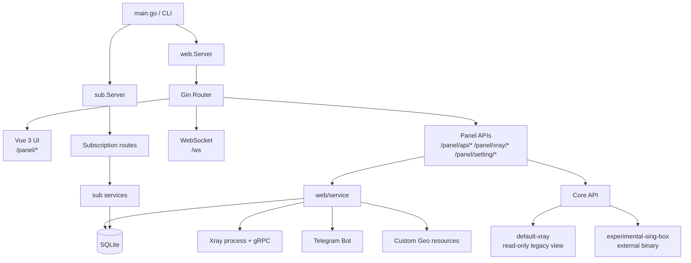
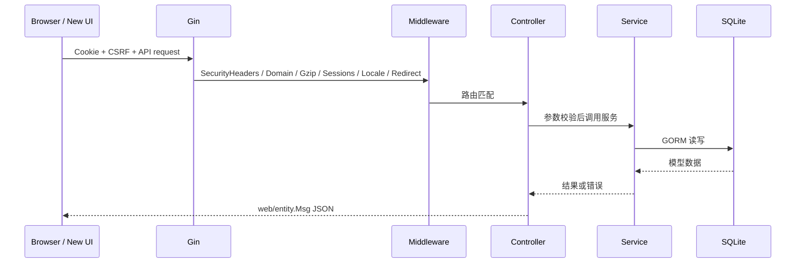
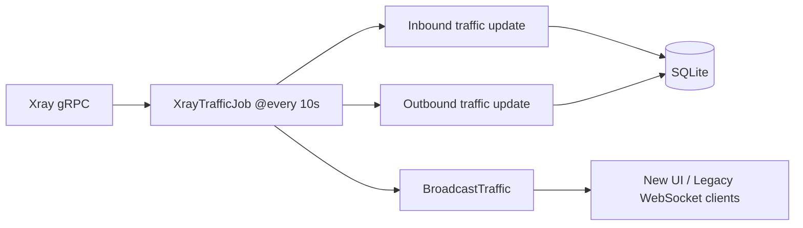
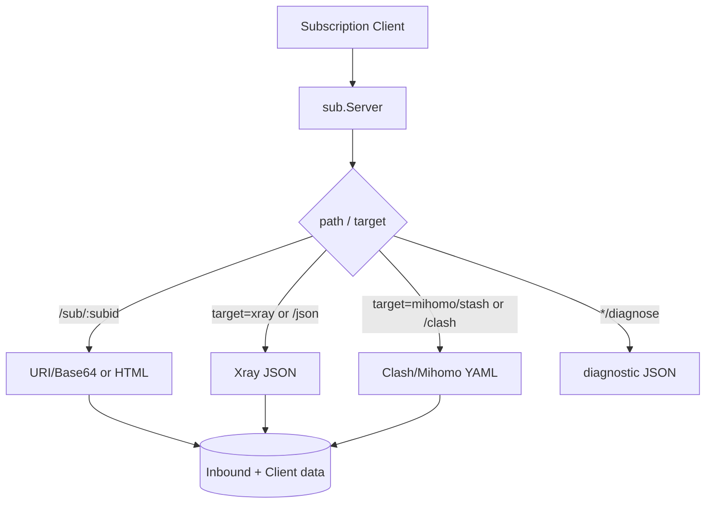

# 系统架构设计

> **目标读者**：开发者 / 架构师 / 发布维护者
> **适用版本**：`v3.4.0`
> **事实来源**：`main.go`、`.codex/project.toml`、`web/`、`sub/`、`core/`、`database/`、`frontend/`、`.github/workflows/release.yml`
> **相关文档**：[核心模块解析](modules.md) | [API 接口说明](api.md) | [开发者贡献指南](development.md) | [AI 平台智能分流与住宅出口运行手册](ai-routing-and-residential-egress.md)

---

## 1. 项目定位

SuperXray-gui 是一个以 Xray-core 为主运行核心的 Web 控制面板。当前代码库处于“新 Vue 3 UI 默认入口 + 旧 HTML UI 已退役 + Phase 9 安全收口 + 最小 Phase 10 Core API 入口”的状态。

核心事实：

| 项目 | 当前实现 |
|---|---|
| 应用名 | `x-ui`，由 `config/name` 提供 |
| 当前版本 | `3.4.0`，由 `config/version` 提供 |
| Go module | `github.com/superaddmin/SuperXray-gui/v2` |
| Go 版本 | `1.26.4`，见 `go.mod` |
| 数据库 | SQLite + GORM |
| 主运行核心 | legacy XrayService + `database/model.Inbound` |
| 新 UI | Vue 3 / Vite / TypeScript / Pinia / Ant Design Vue 4 |
| 新 UI 源码 | `frontend/src` |
| 新 UI 构建产物 | `web/ui`，由 Go embed 托管 |
| 旧 HTML UI | 已退役；`web/html`、`web/assets` 和 `/panel/legacy*` 不再注册 |
| 实验核心入口 | `/panel/api/cores`，当前注册 `default-xray` 和 `experimental-sing-box` |

Release 工作流打包时下载 Xray release `v26.4.25`；Go 依赖中也包含 `github.com/xtls/xray-core v1.260327.0`，用于 API 类型和集成代码。

---

## 2. 总体架构

### 2.1 运行时拓扑



### 2.2 双 HTTP Server

`main.go` 启动两个 HTTP 服务：

| 服务 | 默认端口 | 是否独立 Gin Engine | 职责 |
|:---|:------:|:------------------|:---|
| `web.Server` | `2053` | 是 | 面板页面、API、WebSocket、静态资源、后台任务、TG Bot |
| `sub.Server` | `2096` | 是 | URI/Base64、JSON、Clash/Mihomo 订阅输出和诊断 |

两个服务共享数据库和配置服务，但监听、TLS、域名验证、路由表互相独立。`sub.Server` 只有在 `subEnable=true` 时启动。

### 2.3 新 UI 与旧 API 兼容

| UI | 路由 | 技术栈 | 数据写入约束 |
|---|---|---|---|
| 新 UI | `/panel/`、`/panel/logs`、`/panel/cores`、`/panel/xray`、`/panel/inbounds`、`/panel/settings` | Vue 3/Vite/TS/Pinia/Ant Design Vue 4 | 继续写旧 API 和 `model.Inbound` 兼容数据 |
| 兼容新 UI 入口 | `/panel/ui/*` | 同上 | 同上 |

旧 HTML UI 已退役，`web/html`、`web/assets` 和 `/panel/legacy*` 页面路由不再注册。新 UI 的 runtime config 由 `web/ui.go` 注入 `window.__SUPERXRAY_UI_CONFIG__`。所有页面统一使用 nonce CSP，不再保留 legacy UI 的 `unsafe-inline` / `unsafe-eval` CSP 例外。

---

## 3. 分层结构

### 3.1 后端分层

```text
HTTP request
  -> Gin middleware
  -> controller
  -> service
  -> database / Xray gRPC / filesystem / Telegram / external command
```

| 层 | 目录 | 职责 |
|---|---|---|
| 入口 | `main.go` | CLI 参数、环境加载、数据库初始化、Web/Sub Server 启动、信号处理 |
| Web 路由 | `web/web.go`、`web/ui.go` | Gin engine、中间件、新 UI、WebSocket、后台任务 |
| 控制器 | `web/controller` | 参数绑定、认证检查、调用服务、JSON/文件响应 |
| 服务 | `web/service` | 业务逻辑、Xray 进程、配置、Inbound、订阅辅助、TG Bot、Geo、Core 适配 |
| Core 抽象 | `core` | Core 类型、状态、能力、Manager、sing-box 外部适配器 |
| 数据库 | `database`、`database/model` | SQLite 初始化、GORM 模型、种子迁移 |
| Xray 集成 | `xray` | Xray API、进程和 traffic 结构 |
| 订阅 | `sub` | 独立订阅服务、URI/JSON/Clash 输出、诊断 |

### 3.2 前端分层

```text
frontend/src
  -> api        旧 API SDK、Axios、WebSocket
  -> stores     Pinia app/server/core 状态
  -> views      Dashboard/Logs/Cores/Xray/Inbounds/Settings
  -> utils      Xray JSON 结构化编辑、Inbound 兼容层、导出工具
  -> schemas    协议注册表
  -> types      API/Runtime/Core/Inbound/Xray 类型
```

前端不直接写数据库，也不引入新 `proxy_inbounds` 或 `proxy_clients` 活跃写路径。所有持久化仍走旧面板 API。

---

## 4. 启动与生命周期

### 4.1 `main.go` 启动流程

```mermaid
flowchart TD
    A[main.go] --> B[解析 flag 和子命令]
    B --> C{命令}
    C -->|无参数/run| D[runWebServer]
    C -->|setting| E[面板设置命令]
    C -->|migrate| F[数据库迁移命令]
    C -->|cert| G[证书命令]
    C -->|-v| H[输出 config.GetVersion]

    D --> D1[godotenv 加载 .env]
    D1 --> D2[logger 初始化]
    D2 --> D3[database.InitDB(config.GetDBPath())]
    D3 --> D4[创建 web.Server 并 Start]
    D4 --> D5[创建 sub.Server 并 Start]
    D5 --> D6[监听 SIGHUP/SIGTERM/SIGUSR1]
```

信号行为：

| 信号 | 行为 |
|---|---|
| `SIGHUP` | 重启 Web Server 和 Sub Server，并处理 TG Bot 409 冲突风险 |
| `SIGTERM` | 优雅停止服务 |
| `SIGUSR1` | 仅重启 legacy Xray 进程 |

### 4.2 Xray 生命周期边界

legacy Xray 生命周期仍由 `web/service/XrayService` 和 `ServerController` 管理：

| 操作 | 当前 API |
|---|---|
| 停止 Xray | `POST /panel/api/server/stopXrayService` |
| 启动/重启 Xray | `POST /panel/api/server/restartXrayService` |
| 安装 Xray 版本 | `POST /panel/api/server/installXray/:version` |
| 查看运行配置 | `GET /panel/api/server/getConfigJson` |

`/panel/api/cores` 中的 `default-xray` 只是 legacy Xray 的只读实例视图，不通过 CoreManager 启停。`experimental-sing-box` 是外部二进制实验适配器，支持 validate/start/stop/restart，但不影响 Xray。

---

## 5. 数据模型

### 5.1 AutoMigrate 表

`database/db.go` 迁移以下模型：

| 模型 | 说明 |
|---|---|
| `model.User` | 面板用户 |
| `model.Inbound` | 活跃 Xray 入站写模型 |
| `model.OutboundTraffics` | outbound tag 流量统计 |
| `model.Setting` | 键值对设置 |
| `model.InboundClientIps` | 客户端 IP 记录 |
| `xray.ClientTraffic` | 客户端流量统计 |
| `model.HistoryOfSeeders` | 种子迁移历史 |
| `model.CustomGeoResource` | 自定义 GeoIP/GeoSite 资源 |

### 5.2 Active Xray 写模型

`model.Inbound` 仍是入站配置唯一活跃写模型。关键字段：

```text
id, user_id, up, down, total, all_time,
remark, enable, expiry_time,
traffic_reset, last_traffic_reset_time,
listen, port, protocol,
settings, stream_settings, tag, sniffing
```

其中 `settings`、`streamSettings`、`sniffing` 都是 JSON 字符串。`model.Client` 不是独立表，而是嵌入在 `Inbound.Settings` 的 clients JSON 中；持久化流量统计由 `xray.ClientTraffic` 关联 `InboundId`。

### 5.3 不存在的当前模型

当前代码没有把活跃写路径迁移到下列模型：

- `proxy_inbounds`
- `proxy_clients`
- 统一 `SubscriptionNode` 表
- sing-box 入站图形化写模型

这些概念只允许在后续架构门禁满足后再落地。

---

## 6. 核心数据流

### 6.1 面板 API 请求



### 6.2 Xray 配置保存

```text
New UI XrayView
  -> POST /panel/xray/update
  -> XraySettingService.SaveXraySetting(xraySetting)
  -> SettingService.SetXrayOutboundTestUrl(outboundTestUrl)
  -> legacy XrayService restart is a separate explicit action
```

结构化工具（Outbounds、Routing、DNS、FakeDNS、Balancer、Reverse、Residential IP Pool、Gateway Egress MVP）都只修改 Xray JSON 模板，不创建新数据库表。

### 6.3 Inbound 写入

```text
New UI InboundsView
  -> /panel/api/inbounds/add or update/:id
  -> InboundController ShouldBind(model.Inbound)
  -> InboundService
  -> database/model.Inbound
  -> Xray restart flag if needed
  -> WebSocket inbounds or invalidate
```

新 UI 支持更多协议表单与导出操作，但提交格式仍保持旧 API 和 `model.Inbound` 数据模型兼容。

### 6.4 流量采集与实时推送



`traffic` WebSocket payload 当前包含 `traffics`、`clientTraffics`、`onlineClients`、`lastOnlineMap`。

### 6.5 订阅输出



订阅公开 URI 可由设置直接保存，也可由 `GetDefaultSettings` 根据请求 Host 和订阅路径生成默认值。

---

## 7. 实时通信

`web/websocket/hub.go` 维护单进程 WebSocket Hub：

```go
type Hub struct {
    clients    map[*Client]bool
    broadcast  chan []byte
    register   chan *Client
    unregister chan *Client
    mu         sync.RWMutex
}
```

关键特性：

- `broadcast` 缓冲 2048 条已序列化消息。
- `register` / `unregister` 各缓冲 100。
- 广播时复制客户端切片后释放锁，再按 worker pool 并行发送。
- worker pool 大小为 `runtime.NumCPU()*2`，最小 10，最大 100。
- 单条消息超过 10MB 时降级为 `invalidate`，前端再用 REST 重新拉取。
- 消息时间戳为 Unix milliseconds。

---

## 8. 安全架构

### 8.1 浏览器安全头

`SecurityHeadersMiddleware` 对所有 Web 请求设置：

- `X-Content-Type-Options: nosniff`
- `X-Frame-Options: DENY`
- `Referrer-Policy: same-origin`
- `Content-Security-Policy`

新 UI CSP：

```text
default-src 'self';
script-src 'self' 'nonce-...';
script-src-attr 'none';
style-src 'self' 'nonce-...';
style-src-attr 'none';
img-src 'self' data: blob:;
font-src 'self' data:;
connect-src 'self' ws: wss:;
object-src 'none';
base-uri 'self';
form-action 'self';
frame-ancestors 'none'
```

旧 HTML UI 已退役，CSP 不再为旧模板保留 `unsafe-inline` 或 `unsafe-eval` 例外。

### 8.2 CSRF 与同源校验

状态变更请求必须带 `X-CSRF-Token` 或 `X-XSRF-Token`。若存在 `Origin` 或 `Referer`，必须与当前请求同源。新 UI Axios 自动从 runtime config 注入 token。

### 8.3 下载和导入

- `/panel/api/*` 未登录返回 404。
- 数据库下载、配置下载、日志读取都在登录保护的 API 路由内。
- 数据库导入校验请求体大小、文件大小、文件名、扩展名，并在服务层继续做 SQLite 校验和导入保护。
- Geo 文件名与本地路径经过白名单和安全路径校验，防止路径遍历。
- outbound 测试 URL 使用服务端保存值，不接受请求体中的任意 URL。

### 8.4 日志与外部内容渲染

新 UI 禁止使用 `v-html` 或 `innerHTML` 渲染日志、配置、订阅、外部下载内容。日志和 JSON 预览按文本渲染。

---

## 9. 后台任务

`web.Server` 使用 `robfig/cron/v3` 注册任务：

| 任务 | 频率 | 说明 |
|---|---|---|
| `CheckXrayRunningJob` | `@every 1s` | 检查 Xray 是否运行 |
| Xray restart check | `@every 30s` | 检查 `XrayService` 是否需要重启 |
| `XrayTrafficJob` | `@every 10s` | 采集 inbound/client/outbound 流量并广播 |
| `CheckClientIpJob` | `@every 10s` | 解析 access log，维护客户端 IP 限制 |
| `ClearLogsJob` | `@daily` | 清理日志 |
| `PeriodicTrafficResetJob` | hourly/daily/weekly/monthly | 按策略重置流量 |
| `LdapSyncJob` | 配置值，默认 `@every 1m` | LDAP 用户同步 |
| `StatsNotifyJob` | 配置值，默认 `@daily` | TG Bot 统计通知 |
| `CheckHashStorageJob` | `@every 2m` | 清理 TG Bot 回调哈希 |
| `CheckCpuJob` | `@every 10s` | CPU 告警 |
| Server status refresh | `@every 2s` | 刷新状态、记录 CPU 历史、WebSocket 广播 |

---

## 10. 当前架构门禁

当前阶段允许：

- 维护新 UI、旧 API SDK 和安全收口。
- 使用 `/panel/api/cores` 查看核心实例。
- 对 `experimental-sing-box` 做外部二进制 validate/start/stop/restart。
- 在 Xray JSON 模板层生成 Gateway Egress MVP、AI residential routing、DNS/路由/balancer 等配置。

当前阶段禁止：

- 将 active writes 从 `model.Inbound` 迁走。
- 创建 `proxy_inbounds` 或 `proxy_clients` 作为活跃写路径。
- 让 CoreManager 接管 legacy Xray 生命周期。
- 让旧 HTML UI 或 `/panel/legacy*` 回退重新成为生产入口。
- 在日志、配置、订阅或外部内容预览中使用 HTML 注入式渲染。

---

## 11. 交付与发布边界

`.github/workflows/release.yml` 当前发布 Linux `amd64` 和 `arm64` tarball：

```text
x-ui-linux-amd64.tar.gz
x-ui-linux-arm64.tar.gz
```

发布前会运行 release gate 校验版本、CHANGELOG 和资产命名。构建会把 Go 二进制、service 文件、Xray release、Geo 数据文件和脚本打进 `x-ui` 目录。文档中的版本号、安装说明和 release 资产名称必须随 `config/version` 与工作流同步更新。
