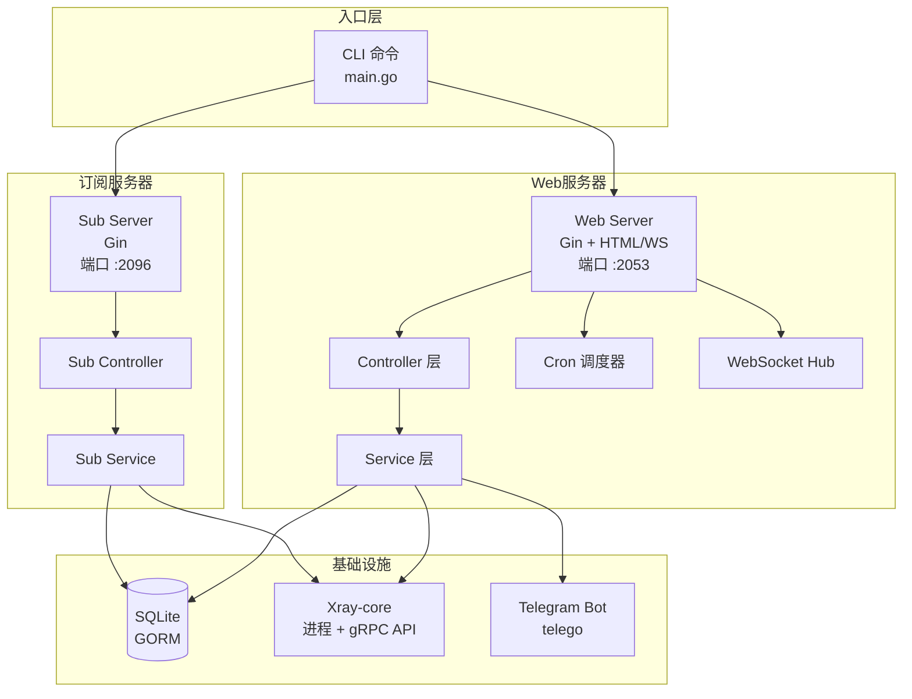
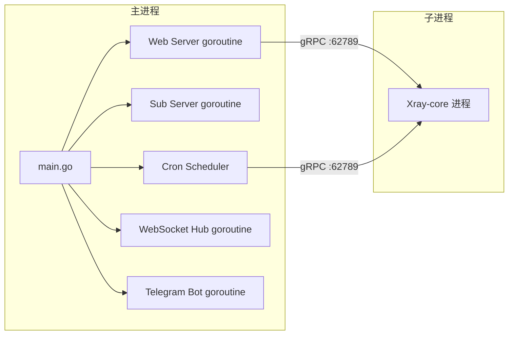
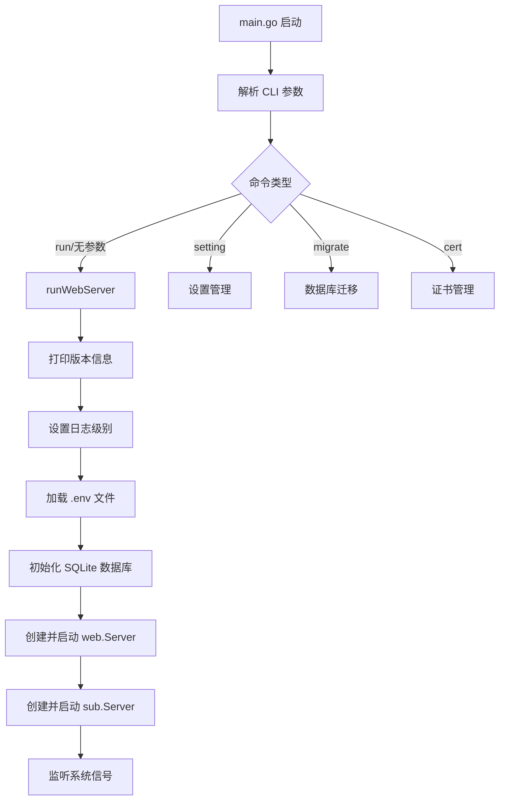
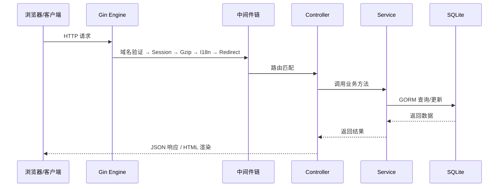
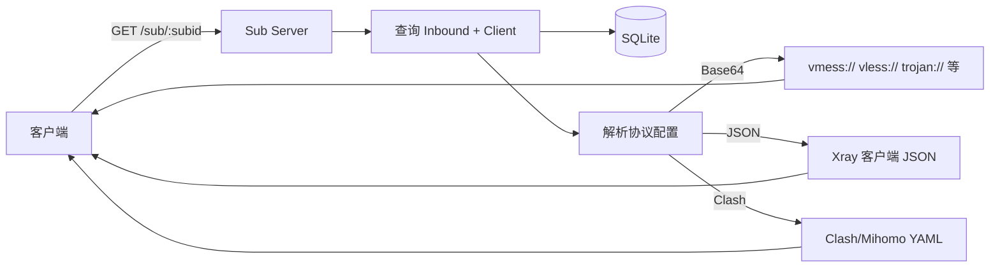
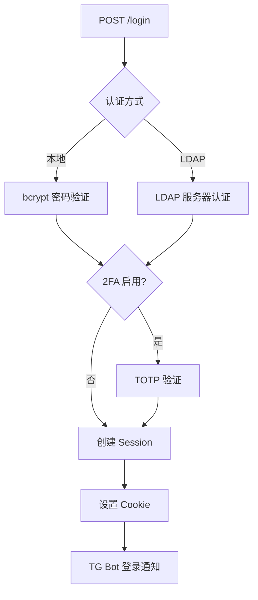
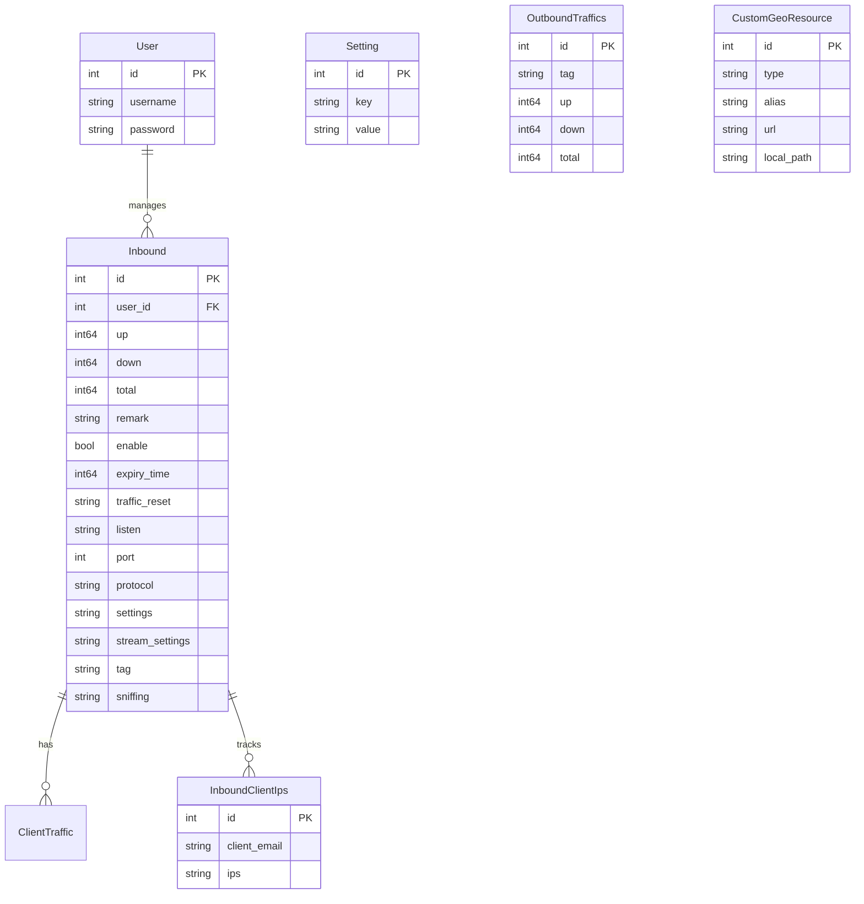
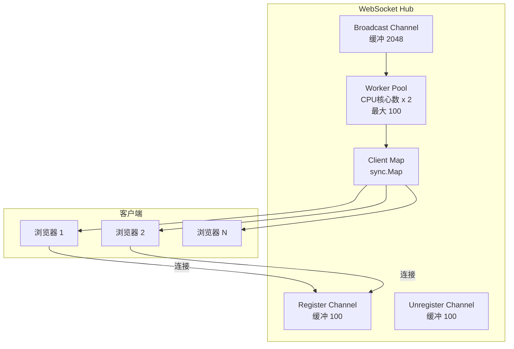

# 系统架构设计

> **目标读者**：开发者 / 架构师  
> **适用版本**：`v2.9.9`
> **相关文档**：[核心模块解析](modules.md) | [API 接口说明](api.md) | [部署指南](deployment.md)

---

## 1. 项目概述

### 1.1 项目定位与背景

**SuperXray** 是一个基于 Web 的高级开源控制面板，专为管理 [Xray-core](https://github.com/XTLS/Xray-core) 代理服务器而设计。作为原始 X-UI 项目的增强分支，SuperXray 提供了更好的稳定性、更广泛的协议支持和丰富的附加功能。

| 属性 | 值 |
|------|-----|
| 项目名称 | `x-ui` |
| 当前版本 | `2.9.9` |
| 模块路径 | `github.com/superaddmin/SuperXray-gui/v2` |
| 许可证 | GPL V3 |
| Go 版本 | `1.26.2` |

### 1.2 核心功能概览

- **多协议支持**：VMess、VLESS、Trojan、Shadowsocks、Hysteria (v1/v2)、WireGuard、HTTP、Mixed、Socks、Dokodemo-door、Tunnel
- **客户端管理**：流量限制、过期时间、IP 限制、订阅 ID
- **实时监控**：流量统计、CPU/内存监控、WebSocket 实时推送
- **Telegram Bot**：通知、管理、备份、统计报告
- **订阅服务**：Base64 链接、JSON 配置、Clash/Mihomo 配置
- **安全特性**：TOTP 双因素认证、LDAP 集成、fail2ban、域名验证
- **扩展集成**：Cloudflare WARP、NordVPN、自定义 GeoIP/GeoSite
- **国际化**：13 种语言支持

### 1.3 技术栈选型

| 层级 | 技术 | 版本 | 用途 |
|------|------|------|------|
| **语言** | Go | 1.26.2 | 后端开发 |
| **Web 框架** | Gin | v1.12.0 | HTTP 路由与中间件 |
| **ORM** | GORM | v1.31.1 | 数据库操作 |
| **数据库** | SQLite | - | 嵌入式数据存储 |
| **代理核心** | Xray-core | v26.4.25 | 代理协议实现 |
| **定时任务** | robfig/cron | v3.0.1 | 后台任务调度 |
| **WebSocket** | gorilla/websocket | - | 实时通信 |
| **Telegram** | telego | - | Bot API |
| **前端** | Vue.js + Ant Design Vue | - | 管理界面 |
| **国际化** | go-i18n | v2 | 多语言支持 |
| **系统监控** | gopsutil | v4 | CPU/内存/磁盘采集 |

---

## 2. 系统架构总览

### 2.1 整体架构图



### 2.2 双服务器架构

SuperXray 采用**双服务器**架构，两个独立的 HTTP 服务运行在同一进程中：

| 服务器 | 默认端口 | 职责 | 入口文件 |
|--------|---------|------|---------|
| **Web Server** | `2053` | 管理面板（API + HTML 页面） | [`web/web.go`](../web/web.go) |
| **Sub Server** | `2096` | 订阅链接服务 | [`sub/sub.go`](../sub/sub.go) |

两个服务器共享同一个 SQLite 数据库实例，但拥有独立的 Gin 路由引擎和 HTTP 监听器。

### 2.3 进程模型与通信方式



**进程间通信方式**：

- **gRPC**：Web 服务器通过 gRPC（端口 `62789`）与 Xray-core 进程通信，获取流量统计、操作 inbound 等
- **信号**：主进程通过 Unix 信号控制生命周期
  - `SIGHUP` → 重启 Web 和 Sub 服务器
  - `SIGTERM` → 优雅关闭
  - `SIGUSR1` → 仅重启 Xray 进程
- **WebSocket**：服务器到前端浏览器的实时推送

---

## 3. 分层架构设计

### 3.1 入口层（CLI）

[`main.go`](../main.go) 是程序入口，提供以下 CLI 命令：

| 命令 | 功能 |
|------|------|
| *(无参数)* | 直接运行 Web 服务器 |
| `run` | 运行 Web 服务器 |
| `setting` | 管理面板设置（端口/用户名/密码/证书/TG Bot） |
| `migrate` | 数据库迁移 |
| `cert` | 管理 SSL 证书 |
| `-v` | 显示版本号 |

**启动流程**：



### 3.2 Web 层

采用经典的 **Controller → Service → Database** 三层架构：

```
HTTP 请求
  → Gin Engine
    → 中间件链（DomainValidator → Session → Gzip → I18n → Redirect）
      → Controller（参数解析、调用 Service）
        → Service（业务逻辑）
          → Database（SQLite/GORM） / Xray API / Telegram API
```

### 3.3 订阅服务层

[`sub/`](../sub/) 包实现独立的订阅 HTTP 服务，支持三种输出格式：

| 格式 | 路径前缀 | 文件 | 说明 |
|------|---------|------|------|
| Base64 链接 | `/sub/` | [`subService.go`](../sub/subService.go) | 生成 vmess://、vless:// 等协议链接 |
| JSON 配置 | `/json/` | [`subJsonService.go`](../sub/subJsonService.go) | 完整 Xray 客户端 JSON 配置 |
| Clash/Mihomo | `/clash/` | [`subClashService.go`](../sub/subClashService.go) | YAML 格式 Clash 配置 |

### 3.4 后台任务层

通过 [`robfig/cron/v3`](https://github.com/robfig/cron) 调度器管理所有定时任务：

| 任务 | 调度频率 | 功能 |
|------|---------|------|
| `CheckXrayRunningJob` | `@every 1s` | Xray 健康检查与自动重启 |
| Xray 重启检查 | `@every 30s` | 检查是否需要重启 |
| `XrayTrafficJob` | `@every 10s` | 流量采集与 WebSocket 推送 |
| `CheckClientIpJob` | `@every 10s` | IP 限制检查与 fail2ban |
| `ClearLogsJob` | `@daily` | 日志文件清理 |
| `PeriodicTrafficResetJob` | hourly/daily/weekly/monthly | 定期流量重置 |
| `LdapSyncJob` | 可配置（默认 `@every 1m`） | LDAP 用户同步 |
| `StatsNotifyJob` | 可配置（默认 `@daily`） | TG Bot 统计报告 |
| `CheckHashStorageJob` | `@every 2m` | TG Bot 哈希清理 |
| `CheckCpuJob` | `@every 10s` | CPU 阈值告警 |
| ServerController 状态刷新 | `@every 2s` | 服务器状态采集 |

### 3.5 基础设施层

| 包 | 职责 |
|-----|------|
| [`config/`](../config/) | 配置管理（版本、日志级别、数据库路径、环境变量） |
| [`database/`](../database/) | SQLite 初始化、迁移、数据模型定义 |
| [`logger/`](../logger/) | 双后端日志系统（控制台/syslog + 文件） |
| [`util/`](../util/) | 工具包（crypto/ldap/random/sys） |

---

## 4. 核心数据流

### 4.1 请求处理流



### 4.2 流量采集与推送流

```mermaid
flowchart LR
    XRAY[Xray-core<br/>gRPC :62789] -->|@every 10s| TRAFFIC[XrayTrafficJob]
    TRAFFIC --> GET[GetXrayTraffic]
    GET --> INBOUND[InboundService.AddTraffic]
    GET --> OUTBOUND[OutboundService.AddTraffic]
    INBOUND --> DB[(SQLite)]
    OUTBOUND --> DB
    TRAFFIC --> WS[WebSocket BroadcastTraffic]
    WS --> BROWSER[前端实时更新]
```

### 4.3 客户端 IP 监控流

```mermaid
flowchart TD
    LOG[Xray Access Log] -->|@every 10s| IPJOB[CheckClientIpJob]
    IPJOB --> PARSE[解析日志提取 IP]
    PARSE --> CHECK{检查 IP 限制}
    CHECK -->|超限| F2B[fail2ban 封禁]
    CHECK -->|未超限| UPDATE[更新 IP 记录]
    F2B --> DB[(SQLite)]
    UPDATE --> DB
```

### 4.4 订阅请求流



### 4.5 认证与安全流



---

## 5. 数据模型设计

### 5.1 ER 关系图



### 5.2 核心模型说明

| 模型 | 文件 | 说明 |
|------|------|------|
| [`User`](../database/model/model.go) | `model.go:40` | 用户账户，存储用户名和 bcrypt 加密密码 |
| [`Inbound`](../database/model/model.go) | `model.go:47` | Xray 入站配置，包含协议、端口、传输设置、流量统计 |
| [`OutboundTraffics`](../database/model/model.go) | `model.go:72` | 出站流量统计，按 Tag 聚合 |
| [`InboundClientIps`](../database/model/model.go) | `model.go:81) | 客户端 IP 记录，JSON 格式存储 IP 列表 |
| [`Setting`](../database/model/model.go) | `model.go:114` | 键值对配置存储，所有面板设置 |
| [`CustomGeoResource`](../database/model/model.go) | `model.go:120` | 自定义 GeoIP/GeoSite 资源定义 |
| [`Client`](../database/model/model.go) | `model.go:133` | 客户端配置（嵌入在 Inbound.Settings JSON 中） |

> **注意**：[`Client`](../database/model/model.go) 模型并非独立的数据库表，而是嵌入在 `Inbound.Settings` JSON 字段中。客户端的流量统计通过 Xray-core 的 gRPC API 获取，存储在内存中。

---

## 6. 实时通信架构

### 6.1 WebSocket Hub 设计

[`web/websocket/hub.go`](../web/websocket/hub.go) 实现了一个高性能的 WebSocket 消息广播中心：



### 6.2 消息类型

| 类型 | 触发场景 | 数据内容 |
|------|---------|---------|
| `status` | 服务器状态更新（@every 2s） | CPU、内存、磁盘、网络、运行时间 |
| `traffic` | 流量采集（@every 10s） | 各 Inbound/Client 的流量增量 |
| `inbounds` | Inbound 列表变更 | 完整 Inbound 列表 |
| `notification` | 系统通知 | 通知消息文本 |
| `xray_state` | Xray 状态变化 | 运行/停止/错误状态 |
| `outbounds` | Outbound 列表更新 | Outbound 流量统计 |
| `invalidate` | 轻量级刷新信号 | 无数据，仅触发前端刷新 |

### 6.3 并发控制

- **Worker Pool**：广播任务分发到固定数量的 Worker（`CPU核心数 × 2`，最大 100）
- **缓冲通道**：broadcast 通道缓冲 2048 条消息，register/unregister 各缓冲 100
- **优雅关闭**：通过 Context 取消实现优雅关闭
- **Panic 恢复**：每个 Worker 内置 panic recovery，自动重启

---

## 7. 安全架构

### 7.1 认证机制

| 机制 | 实现文件 | 说明 |
|------|---------|------|
| 本地密码 | [`util/crypto/crypto.go`](../util/crypto/crypto.go) | bcrypt 哈希 |
| LDAP | [`util/ldap/ldap.go`](../util/ldap/ldap.go) | 外部 LDAP 服务器认证 |
| TOTP 2FA | [`web/service/user.go`](../web/service/user.go) | 基于 TOTP 的双因素认证 |
| Session | [`web/session/session.go`](../web/session/session.go) | Cookie-based Session |

### 7.2 域名验证中间件

[`web/middleware/domainValidator.go`](../web/middleware/domainValidator.go) 验证请求的 Host 头是否匹配配置的域名，防止未授权域名访问。

### 7.3 fail2ban 集成

在 Docker 环境中，通过 [`DockerEntrypoint.sh`](../DockerEntrypoint.sh) 启动 fail2ban 服务。[`web/job/check_client_ip_job.go`](../web/job/check_client_ip_job.go) 检测超限 IP 并调用 fail2ban-client 进行封禁。

### 7.4 路径遍历与 SSRF 防护

- **Geo 文件名验证**：[`web/controller/server.go`](../web/controller/server.go) 使用正则 `^[a-zA-Z0-9_\-.]+$` 验证文件名
- **API 认证隐藏**：未认证的 API 请求返回 404（而非 401），隐藏 API 端点存在性
- **外部代理 URL 验证**：防止 SSRF 攻击

---

## 8. 国际化架构

### 8.1 翻译文件组织

翻译文件采用 TOML 格式，位于 [`web/translation/`](../web/translation/) 目录：

```
web/translation/
├── translate.en_US.toml    # 英语（基准语言）
├── translate.zh_CN.toml    # 简体中文
├── translate.zh_TW.toml    # 繁体中文
├── translate.fa_IR.toml    # 波斯语
├── translate.ar_EG.toml    # 阿拉伯语
├── translate.ru_RU.toml    # 俄语
├── translate.uk_UA.toml    # 乌克兰语
├── translate.es_ES.toml    # 西班牙语
├── translate.pt_BR.toml    # 葡萄牙语（巴西）
├── translate.ja_JP.toml    # 日语
├── translate.vi_VN.toml    # 越南语
├── translate.tr_TR.toml    # 土耳其语
└── translate.id_ID.toml    # 印尼语
```

### 8.2 go-i18n 集成方式

[`web/locale/locale.go`](../web/locale/locale.go) 通过 `nicksnyder/go-i18n/v2` 实现国际化：

- **Web 端**：通过 Gin 中间件 `locale.LocalizerMiddleware()` 注入本地化函数
- **Telegram Bot 端**：独立的 Localizer 实例，支持 Bot 专用语言设置
- **模板函数**：HTML 模板中使用 `{{ i18n "key" }}` 调用翻译
- **嵌入资源**：翻译文件通过 `//go:embed translation/*` 嵌入二进制
