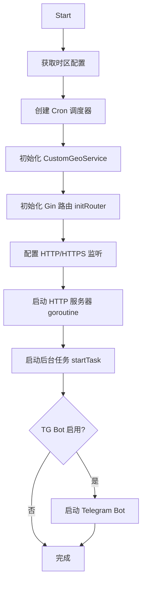

# 核心模块解析

> **目标读者**：开发者  
> **相关文档**：[系统架构设计](architecture.md) | [API 接口说明](api.md) | [开发者贡献指南](development.md)

---

## 1. 程序入口（main.go）

[`main.go`](../main.go) 是整个应用的入口点，负责 CLI 命令解析和服务启动。

### 1.1 CLI 命令解析

使用 Go 标准库 `flag` 包实现命令行参数解析：

```go
// 全局参数
-v          // 显示版本号

// 子命令
run         // 运行 Web 服务器（默认行为）
setting     // 管理面板设置
migrate     // 数据库迁移
cert        // SSL 证书管理
```

### 1.2 启动流程

[`runWebServer()`](../main.go) 函数的执行步骤：

1. 打印版本信息（`config.GetName()` + `config.GetVersion()`）
2. 根据日志级别初始化日志系统
3. 加载 `.env` 文件（通过 `godotenv`）
4. 初始化 SQLite 数据库（`database.InitDB()`）
5. 创建并启动 `web.Server`（Web 管理面板）
6. 创建并启动 `sub.Server`（订阅服务）
7. 监听系统信号

### 1.3 信号处理

```go
signal.Notify(sigCh, syscall.SIGHUP, syscall.SIGTERM, sys.SIGUSR1)
```

| 信号 | 行为 |
|------|------|
| `SIGHUP` | 重启 Web Server 和 Sub Server（先停止 TG Bot 防止 409 冲突） |
| `SIGTERM` | 优雅关闭所有服务 |
| `SIGUSR1` | 仅重启 Xray 进程 |

---

## 2. 配置管理（config/）

[`config/config.go`](../config/config.go) 提供全局配置管理。

### 2.1 配置加载机制

配置通过环境变量和文件读取：

```go
// 版本信息（编译时嵌入）
//go:embed version
var version string

//go:embed name
var name string
```

### 2.2 环境变量映射

| 函数 | 环境变量 | 默认值 | 说明 |
|------|---------|--------|------|
| `IsDebug()` | `XUI_DEBUG` | `false` | 调试模式 |
| `GetLogLevel()` | `XUI_LOG_LEVEL` | `info` | 日志级别 |
| `GetDBPath()` | `XUI_DB_FOLDER` | `x-ui` | 数据库路径 |
| `GetLogPath()` | `XUI_LOG_FOLDER` | `x-ui` | 日志路径 |
| `GetBinPath()` | `XUI_BIN_FOLDER` | `x-ui` | 二进制路径 |

### 2.3 版本管理

- [`config/version`](../config/version)：存储版本号 `2.9.6`
- [`config/name`](../config/name)：存储应用名 `x-ui`

---

## 3. 数据库层（database/）

### 3.1 初始化与迁移

[`database/db.go`](../database/db.go) 负责数据库初始化：

```go
func InitDB(dbPath string) error
```

**初始化流程**：
1. 创建数据库目录
2. 打开 SQLite 连接（通过 GORM）
3. `AutoMigrate` 所有模型表
4. 创建默认 admin 用户（用户名/密码：`admin`/`admin`）
5. 运行种子数据迁移

### 3.2 数据模型详解

所有模型定义在 [`database/model/model.go`](../database/model/model.go)：

#### User（用户）

```go
type User struct {
    Id       int    // 主键，自增
    Username string // 用户名
    Password string // bcrypt 加密密码
}
```

#### Inbound（入站配置）

```go
type Inbound struct {
    Id                   int      // 主键
    UserId               int      // 关联用户 ID
    Up                   int64    // 上传流量（字节）
    Down                 int64    // 下载流量（字节）
    Total                int64    // 总流量限制（字节）
    AllTime              int64    // 历史总流量
    Remark               string   // 备注
    Enable               bool     // 是否启用
    ExpiryTime           int64    // 过期时间戳
    TrafficReset         string   // 流量重置周期（never/hourly/daily/weekly/monthly）
    LastTrafficResetTime int64    // 上次重置时间
    Listen               string   // 监听地址
    Port                 int      // 监听端口
    Protocol             Protocol // 协议类型
    Settings             string   // 协议设置（JSON）
    StreamSettings       string   // 传输层设置（JSON）
    Tag                  string   // 唯一标签
    Sniffing             string   // 嗅探设置（JSON）
}
```

#### Client（客户端配置）

```go
type Client struct {
    ID         string // 客户端唯一标识（UUID）
    Security   string // 加密方式
    Password   string // 密码
    Flow       string // 流控（XTLS）
    Auth       string // 认证密码（Hysteria）
    Email      string // 客户端标识邮箱
    LimitIP    int    // IP 限制数
    TotalGB    int64  // 流量限制（GB）
    ExpiryTime int64  // 过期时间戳
    Enable     bool   // 是否启用
    TgID       int64  // Telegram 用户 ID
    SubID      string // 订阅 ID
    Comment    string // 备注
    Reset      int    // 重置周期（天）
}
```

> **重要**：`Client` 不是独立的数据库表，而是嵌入在 `Inbound.Settings` JSON 字段中。

#### 支持的协议

```go
const (
    VMESS       Protocol = "vmess"
    VLESS       Protocol = "vless"
    Tunnel      Protocol = "tunnel"
    HTTP        Protocol = "http"
    Trojan      Protocol = "trojan"
    Shadowsocks Protocol = "shadowsocks"
    Mixed       Protocol = "mixed"
    WireGuard   Protocol = "wireguard"
    Hysteria    Protocol = "hysteria"
    Hysteria2   Protocol = "hysteria2"
)
```

---

## 4. Web 服务器（web/）

### 4.1 服务器启动流程

[`web/web.go`](../web/web.go) 中的 [`Server.Start()`](../web/web.go) 方法：



### 4.2 路由注册

[`initRouter()`](../web/web.go) 方法注册所有路由和中间件：

```go
func (s *Server) initRouter() (*gin.Engine, error) {
    engine := gin.Default()
    
    // 中间件注册顺序
    engine.Use(middleware.DomainValidatorMiddleware(webDomain))  // 域名验证
    engine.Use(gzip.Gzip(gzip.DefaultCompression))              // Gzip 压缩
    engine.Use(sessions.Sessions("SuperXray", store))               // Session 管理
    engine.Use(locale.LocalizerMiddleware())                     // 国际化
    
    // 控制器注册
    s.index = controller.NewIndexController(g)       // 首页/登录
    s.panel = controller.NewXUIController(g)          // 面板页面
    s.api = controller.NewAPIController(g, ...)       // API 接口
    
    // WebSocket
    s.wsHub = websocket.NewHub()
    g.GET("/ws", s.ws.HandleWebSocket)
}
```

### 4.3 中间件链

请求经过的中间件顺序：

```
HTTP 请求
  → DomainValidatorMiddleware（域名验证，可选）
  → Gzip（压缩）
  → Sessions（Cookie Session）
  → basePath 注入
  → 静态资源缓存（Cache-Control: max-age=31536000）
  → LocalizerMiddleware（国际化语言检测）
  → RedirectMiddleware（/xui → /panel 重定向）
```

### 4.4 模板渲染

- **开发模式**（`XUI_DEBUG=true`）：从本地文件系统加载 HTML 模板
- **生产模式**：从嵌入的 `//go:embed html/*` 加载模板

### 4.5 后台任务调度

[`startTask()`](../web/web.go) 注册所有 Cron 任务，详见 [系统架构设计 - 后台任务层](architecture.md#34-后台任务层)。

---

## 5. 控制器层（web/controller/）

### 5.1 BaseController

[`base.go`](../web/controller/base.go) 提供所有控制器的公共方法：

- `isLogin(c)` - 检查用户是否已登录
- `getI18nWebFunc(c)` - 获取 Web 国际化函数

### 5.2 IndexController

[`index.go`](../web/controller/index.go) 处理首页和认证：

| 方法 | 路由 | 功能 |
|------|------|------|
| `index` | `GET /` | 首页（已登录重定向到 panel） |
| `login` | `POST /login` | 用户登录 |
| `logout` | `GET /logout` | 用户登出 |
| `getTwoFactorEnable` | `POST /getTwoFactorEnable` | 获取 2FA 状态 |

### 5.3 XUIController

[`xui.go`](../web/controller/xui.go) 处理面板页面路由：

| 方法 | 路由 | 功能 |
|------|------|------|
| `index` | `GET /panel/` | 面板首页 |
| `inbounds` | `GET /panel/inbounds` | Inbounds 管理页 |
| `settings` | `GET /panel/settings` | 设置页 |
| `xray` | `GET /panel/xray` | Xray 配置页 |

同时初始化 `SettingController` 和 `XraySettingController`。

### 5.4 InboundController

[`inbound.go`](../web/controller/inbound.go) 处理 Inbound CRUD 和客户端管理（494 行），详见 [API 接口说明 - Inbound 管理](api.md#6-inbound-管理-api)。

### 5.5 SettingController

[`setting.go`](../web/controller/setting.go) 处理面板设置管理：

| 方法 | 路由 | 功能 |
|------|------|------|
| `getAllSetting` | `POST /panel/setting/all` | 获取所有设置 |
| `getDefaultSetting` | `POST /panel/setting/defaultSettings` | 获取默认设置 |
| `updateSetting` | `POST /panel/setting/update` | 更新设置 |
| `updateUser` | `POST /panel/setting/updateUser` | 更新用户名/密码 |
| `restartPanel` | `POST /panel/setting/restartPanel` | 重启面板 |

### 5.6 XraySettingController

[`xray_setting.go`](../web/controller/xray_setting.go) 处理 Xray 配置管理，包括 WARP 和 NordVPN 操作。

### 5.7 ServerController

[`server.go`](../web/controller/server.go) 处理服务器状态、Xray 管理、日志查询等（364 行）。

**特殊机制**：ServerController 自带后台任务，每 2 秒刷新服务器状态并通过 WebSocket 广播：

```go
func (a *ServerController) startTask() {
    c.AddFunc("@every 2s", func() {
        a.refreshStatus()
    })
}
```

### 5.8 APIController

[`api.go`](../web/controller/api.go) 作为 API 路由组的入口：

```go
func (a *APIController) initRouter(g *gin.RouterGroup, customGeo *service.CustomGeoService) {
    api := g.Group("/panel/api")
    api.Use(a.checkAPIAuth)  // 未认证返回 404（隐藏 API 存在）
    
    inbounds := api.Group("/inbounds")
    a.inboundController = NewInboundController(inbounds)
    
    server := api.Group("/server")
    a.serverController = NewServerController(server)
    
    NewCustomGeoController(api.Group("/custom-geo"), customGeo)
}
```

### 5.9 WebSocketController

[`websocket.go`](../web/controller/websocket.go) 处理 WebSocket 连接升级和消息分发。

### 5.10 CustomGeoController

[`custom_geo.go`](../web/controller/custom_geo.go) 处理自定义 GeoIP/GeoSite 资源管理。

---

## 6. 服务层（web/service/）

### 6.1 SettingService

[`setting.go`](../web/service/setting.go)（859 行）管理所有面板配置。配置以键值对形式存储在 `settings` 表中。

**核心方法**：

| 方法 | 功能 |
|------|------|
| `GetAllSetting()` | 获取所有设置（合并为 `AllSetting` 结构体） |
| `SaveSetting(setting)` | 保存所有设置 |
| `GetPort()` / `GetListen()` | 获取端口/监听地址 |
| `GetCertFile()` / `GetKeyFile()` | 获取证书路径 |
| `GetTgbotEnabled()` | 获取 TG Bot 启用状态 |
| `GetLdapEnable()` | 获取 LDAP 启用状态 |

### 6.2 InboundService

[`inbound.go`](../web/service/inbound.go)（2804 行，最大服务文件之一）处理所有 Inbound 和客户端业务逻辑：

- Inbound CRUD 操作
- 客户端管理（添加/删除/更新/复制）
- 流量统计和重置
- 客户端 IP 追踪
- 在线状态检测
- 数据导入导出
- 订阅链接生成辅助

### 6.3 XrayService

[`xray.go`](../web/service/xray.go) 管理 Xray-core 进程生命周期：

| 方法 | 功能 |
|------|------|
| `RestartXray()` | 重启 Xray 进程 |
| `StopXray()` | 停止 Xray 进程 |
| `GetXrayTraffic()` | 通过 gRPC 获取流量统计 |
| `IsNeedRestartAndSetFalse()` | 检查是否需要重启 |

### 6.4 ServerService

[`server.go`](../web/service/server.go)（1329 行）提供服务器状态监控：

- CPU、内存、磁盘、网络 IO 采集（通过 `gopsutil`）
- Xray 版本查询和安装
- 日志查询
- 数据库导入导出
- CPU 历史数据聚合

### 6.5 UserService

[`user.go`](../web/service/user.go) 处理用户认证：

- 本地密码验证（bcrypt）
- LDAP 认证
- TOTP 双因素认证
- 用户名/密码更新

### 6.6 TgbotService

[`tgbot.go`](../web/service/tgbot.go)（3823 行，项目最大文件）实现 Telegram Bot 功能：

- Bot 命令处理（状态查询、流量统计、Inbound 管理）
- 登录通知
- 定期统计报告
- 数据库备份发送
- 回调查询处理（使用 HashStorage 防重放）
- 二维码生成

### 6.7 OutboundService

[`outbound.go`](../web/service/outbound.go) 管理出站流量统计和连通性测试。

### 6.8 WarpService / NordService

- [`warp.go`](../web/service/warp.go)：Cloudflare WARP 集成（注册、配置、密钥管理）
- [`nord.go`](../web/service/nord.go)：NordVPN 集成（国家/服务器查询、注册、密钥管理）

### 6.9 CustomGeoService

[`custom_geo.go`](../web/service/custom_geo.go) 管理自定义 GeoIP/GeoSite 资源：

- 资源验证和下载
- 本地缓存管理
- 启动时自动检查更新

---

## 7. 后台任务（web/job/）

### 7.1 Cron 调度系统

使用 [`robfig/cron/v3`](https://github.com/robfig/cron) 库，支持秒级精度的 Cron 表达式。

### 7.2 各 Job 详解

| Job 文件 | 任务名 | 频率 | 功能 |
|----------|--------|------|------|
| [`check_xray_running_job.go`](../web/job/check_xray_running_job.go) | `CheckXrayRunningJob` | `@every 1s` | 检查 Xray 进程状态，异常时自动重启 |
| [`xray_traffic_job.go`](../web/job/xray_traffic_job.go) | `XrayTrafficJob` | `@every 10s` | 通过 gRPC 采集流量数据，更新数据库并 WebSocket 推送 |
| [`check_client_ip_job.go`](../web/job/check_client_ip_job.go) | `CheckClientIpJob` | `@every 10s` | 解析 Xray 访问日志，检查 IP 限制，触发 fail2ban |
| [`clear_logs_job.go`](../web/job/clear_logs_job.go) | `ClearLogsJob` | `@daily` | 清理过期的日志文件 |
| [`periodic_traffic_reset_job.go`](../web/job/periodic_traffic_reset_job.go) | `PeriodicTrafficResetJob` | hourly/daily/weekly/monthly | 根据配置周期重置 Inbound 流量 |
| [`ldap_sync_job.go`](../web/job/ldap_sync_job.go) | `LdapSyncJob` | 可配置 | 同步 LDAP 用户，自动创建/删除 |
| [`stats_notify_job.go`](../web/job/stats_notify_job.go) | `StatsNotifyJob` | 可配置 | 通过 TG Bot 发送统计报告 |
| [`check_cpu_usage.go`](../web/job/check_cpu_usage.go) | `CheckCpuJob` | `@every 10s` | CPU 超阈值时通过 TG Bot 告警 |
| [`check_hash_storage.go`](../web/job/check_hash_storage.go) | `CheckHashStorageJob` | `@every 2m` | 清理过期的 TG Bot 回调查询哈希 |

---

## 8. WebSocket 实时通信（web/websocket/）

### 8.1 Hub 架构

[`hub.go`](../web/websocket/hub.go) 实现 WebSocket 消息广播中心：

```go
type Hub struct {
    clients    sync.Map           // 已注册的客户端连接
    broadcast  chan *Message       // 广播消息通道（缓冲 2048）
    register   chan *Client        // 注册通道（缓冲 100）
    unregister chan *Client        // 注销通道（缓冲 100）
    ctx        context.Context     // 上下文控制
    cancel     context.CancelFunc  // 取消函数
}
```

### 8.2 消息广播

[`notifier.go`](../web/websocket/notifier.go) 提供广播通知函数：

```go
func BroadcastStatus(status any)     // 广播服务器状态
func BroadcastTraffic(traffic any)   // 广播流量数据
func BroadcastInbounds(inbounds any) // 广播 Inbound 列表
func BroadcastNotification(msg string) // 广播通知
```

### 8.3 并发控制

- **Worker Pool**：广播任务分发到 Worker 池（`runtime.NumCPU() * 2`，最大 100）
- **缓冲通道**：broadcast 缓冲 2048 条消息
- **Panic 恢复**：每个 Worker 内置 `defer recover` 机制

---

## 9. 订阅服务（sub/）

### 9.1 订阅服务器架构

[`sub/sub.go`](../sub/sub.go) 实现独立的订阅 HTTP 服务器，与 Web Server 共享数据库和模板资源。

### 9.2 Base64 订阅

[`sub/subService.go`](../sub/subService.go)（1484 行）生成标准协议链接：

| 协议 | 链接格式 |
|------|---------|
| VMess | `vmess://base64(json)` |
| VLESS | `vless://uuid@host:port?params` |
| Trojan | `trojan://password@host:port?params` |
| Shadowsocks | `ss://base64(method:password)@host:port` |
| Hysteria | `hysteria://password@host:port?params` |

### 9.3 JSON 订阅

[`sub/subJsonService.go`](../sub/subJsonService.go) 生成完整的 Xray 客户端 JSON 配置，支持：

- Fragment（分片）
- Noises（噪声）
- Mux（多路复用）
- 自定义路由规则

### 9.4 Clash/Mihomo 订阅

[`sub/subClashService.go`](../sub/subClashService.go) 生成 YAML 格式的 Clash/Mihomo 代理配置。

---

## 10. 工具包（util/）

### 10.1 crypto - 密码哈希

[`util/crypto/crypto.go`](../util/crypto/crypto.go) 提供 bcrypt 密码哈希功能：

```go
func HashPassword(password string) (string, error)  // 哈希密码
func CheckPassword(password, hash string) bool        // 验证密码
```

### 10.2 ldap - LDAP 认证

[`util/ldap/ldap.go`](../util/ldap/ldap.go) 封装 LDAP 认证逻辑：

```go
func Authenticate(host, port, bindDN, password, baseDN, userFilter, userAttr, username string) error
```

### 10.3 random - 随机数生成

[`util/random/random.go`](../util/random/random.go) 生成随机字符串和数字。

### 10.4 sys - 系统信息

平台特定的系统信息采集：

| 文件 | 平台 |
|------|------|
| [`sys_linux.go`](../util/sys/sys_linux.go) | Linux |
| [`sys_darwin.go`](../util/sys/sys_darwin.go) | macOS |
| [`sys_windows.go`](../util/sys/sys_windows.go) | Windows |
| [`psutil.go`](../util/sys/psutil.go) | 跨平台进程工具 |

---

## 11. 日志系统（logger/）

[`logger/logger.go`](../logger/logger.go) 实现双后端日志系统：

### 11.1 双后端日志

- **后端 1**：控制台输出（或 syslog，取决于平台）
- **后端 2**：文件输出（`x-ui.log`）

### 11.2 内存缓冲

日志系统支持内存缓冲，可以在需要时获取最近的日志记录（用于 API 查询）。

### 11.3 日志级别

| 级别 | 常量 | 说明 |
|------|------|------|
| `DEBUG` | `logging.DEBUG` | 调试信息 |
| `INFO` | `logging.INFO` | 常规信息 |
| `NOTICE` | `logging.NOTICE` | 通知信息 |
| `WARNING` | `logging.WARNING` | 警告信息 |
| `ERROR` | `logging.ERROR` | 错误信息 |
