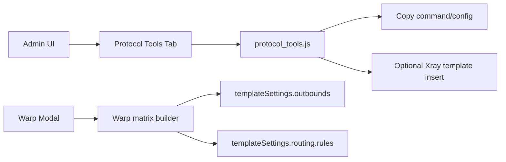

# Xray 兼容协议组合增强设计

## 背景

本项目当前是基于 Xray-core 的单内核面板。现有能力覆盖 VMess、VLESS、Trojan、Shadowsocks、Hysteria、WireGuard、HTTP、Mixed、Socks、Dokodemo-door、Tunnel、Tun，以及 Xray 出站、路由、订阅和 WARP/NordVPN 辅助配置。

用户希望补齐类似 argosbx 的周边能力，包括 Argo 临时/固定隧道、TUIC、AnyTLS、Any-Reality 协议组合、协议组合命令/配置生成器页面，以及 WARP 出站组合矩阵。

## 已确认边界

采用“Xray 兼容增强”路线：

- 不引入 sing-box 多内核。
- 不把 TUIC、AnyTLS 注册成 Xray inbound 协议。
- 不让面板自动运行或托管 cloudflared 进程。
- 新能力优先作为配置生成、命令生成、订阅/路由辅助和兼容性提示落地。
- 所有保存到 Xray 模板的配置必须仍是当前 Xray-core 可解析的 JSON。

## 目标

1. 增加 Argo 临时/固定隧道自动化配置生成。
2. 增加 TUIC、AnyTLS、Any-Reality 等协议/组合支持评估。
3. 增加“协议组合命令/配置生成器”页面。
4. 将 WARP 出站从单点配置扩展为可选组合矩阵。

## 非目标

- 不新增 Cloudflare 账号 API 自动创建隧道。
- 不保存 Cloudflare API Token。
- 不新增 sing-box 运行时、systemd 服务或 Docker 镜像内核。
- 不修改 Xray-core 依赖或协议实现。
- 不在入站表单新增当前 Xray-core 不支持的 TUIC/AnyTLS 协议。

## 功能设计

### Argo 隧道配置生成

在 Xray 设置页新增协议工具页面。用户选择：

- Quick Tunnel：输入本地源站地址，例如 `http://localhost:2053` 或 `http://127.0.0.1:2053`。
- Fixed Tunnel：输入 Cloudflare Tunnel token、源站地址、可选 tunnel 名称。

页面输出：

- cloudflared 临时隧道命令。
- token 驱动固定隧道命令。
- Linux systemd 片段。
- Docker Compose 片段。
- 可复制的 Xray externalProxy 建议配置。

安全约束：

- Token 只参与前端生成，不通过后端接口保存。
- 输出区默认可见，便于复制；不进入数据库。

### 协议组合生成器

新增组合模板：

- VLESS Reality Vision。
- VLESS XHTTP Reality Vision。
- VLESS WS TLS。
- Trojan TCP TLS。
- Shadowsocks 2022。
- Hysteria2 TLS。
- TUIC sing-box 外部配置。
- AnyTLS sing-box 外部配置。

输出类型：

- Xray inbound JSON。
- Xray outbound JSON。
- 分享链接（适用于已有协议）。
- sing-box 配置片段（仅 TUIC / AnyTLS）。
- 支持状态和注意事项。

兼容性规则：

- Xray 原生组合可生成可保存 JSON。
- TUIC / AnyTLS 只生成外部 sing-box 配置并标记“不支持保存为 Xray 入站”。
- Any-Reality 以 Xray VLESS Reality + Vision / VLESS encryption 组合表达，不作为独立协议。

### WARP 出站组合矩阵

基于现有 WARP 注册和配置获取能力，扩展前端应用方式：

- `warp`：通用 WARP 出站。
- `warp-ipv4`：IPv4 优先/强制策略出站。
- `warp-ipv6`：IPv6 优先/强制策略出站。
- `warp-openai`：面向 `geosite:openai` 的路由出站。

用户在 WARP 模态框中选择矩阵项并应用。应用时：

- 生成对应 WireGuard outbounds。
- 可选生成 routing rules。
- 清理旧的 `warp` / `warp-*` 出站和对应路由，避免重复。
- 不影响非 WARP 出站和用户其他路由。

### 前端位置

在 `web/html/xray.html` 的 Xray 设置页面增加新标签页：

- 标签：`Protocol Tools`
- 模板：`web/html/settings/xray/protocol_tools.html`
- 脚本：`web/assets/js/model/protocol_tools.js`

页面使用现有 Vue + Ant Design Vue 模式，不新增前端依赖。

## 数据流



## 测试策略

新增纯 JS 单元测试，覆盖：

- Argo Quick Tunnel 命令生成。
- Argo Fixed Tunnel 命令、systemd、Compose 生成。
- Xray 组合模板生成有效 JSON。
- TUIC / AnyTLS 被标记为 external-only。
- WARP 矩阵生成多个 WireGuard outbounds。
- WARP 矩阵清理旧 `warp-*` 配置时不删除非 WARP 配置。

继续运行：

```powershell
node --test web/assets/js/model/protocol_tools.test.js
node --test web/assets/js/model/inbound.test.js web/assets/js/model/inbound_form_help.test.js
$env:PATH='C:\msys64\mingw64\bin;' + $env:PATH
go test ./...
git diff --check
```

## 风险与回滚

- 风险：前端 Xray 设置页脚本较大，新增页面需避免污染既有保存链路。
- 风险：WARP 自动清理规则必须只匹配 `warp` / `warp-*`，不能误删其他用户路由。
- 风险：TUIC / AnyTLS 若误写入 Xray 模板会导致 Xray 启动失败，因此只作为 external-only 输出。
- 回滚：删除新增模板和 JS 文件，移除 xray.html 标签页和 warp modal 矩阵入口即可恢复旧行为。

## 完成标准

- 新增协议工具页面可生成 Argo、Xray 组合、sing-box 外部组合配置。
- WARP 模态框支持选择矩阵项并应用到 Xray template。
- 相关 JS 单元测试通过。
- Go 全量测试通过。
- 不改变既有入站协议保存逻辑。
