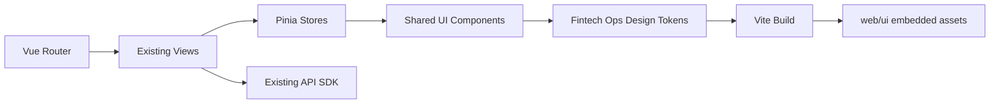

# SuperXray Fintech Ops Console UI 优化设计

## 背景

本次 UI 优化以参考页面 `https://ui-ux-pro-max-skill.nextlevelbuilder.io/demo/fintech-crypto` 为视觉基准。参考页的核心视觉语言是深色金融科技风格：深海军蓝背景、细密网格纹理、玻璃态卡片、霓虹绿色主行动按钮、电蓝色信息强调、强对比标题层级，以及指标驱动的可信赖感。

SuperXray-gui 当前新 UI 已使用 Vue 3、Vite、TypeScript、Pinia、Vue Router 和 Ant Design Vue 4，并通过 Go 托管到 `web/ui/`。项目仍保留旧 UI 作为回退入口，因此本设计只面向新 Vue UI 和嵌入式构建产物，不触碰旧 UI 模板和旧数据兼容语义。

## 已确认范围

采用用户确认的方案 B：

- 优化 `frontend/` 新 Vue UI 的视觉系统、布局、组件状态、响应式和交互反馈。
- 构建后刷新 `web/ui/`，确保 Go 面板实际加载优化后的新 UI。
- 保留 `/panel/legacy/` 旧 UI 回退边界。
- 不修改后端 API 行为、数据库模型、旧订阅输出语义或 Xray/CoreManager 生命周期。

## 非目标

- 不重写旧 `web/html` 和 `web/assets` 页面。
- 不迁移 `model.Inbound` 或旧 Xray 数据模型。
- 不引入新的后端接口、数据库迁移或多内核能力变更。
- 不使用 `v-html` 渲染日志、配置预览、订阅内容或用户输入。
- 不通过外部 Google Fonts 运行时加载字体，因为新 UI CSP 的 `font-src` 只允许 `self` 和 `data:`。
- 不把参考页的营销型大 hero 直接套到后台页面，避免降低日常运维效率。

## 设计方向

方向名称：Fintech Ops Console。

设计目标是把参考页的金融科技视觉语言转译为高密度运维控制台：

- 保留后台左侧导航和多页面工作流。
- 用深色网格背景和玻璃态工作面板建立统一视觉氛围。
- 用霓虹绿表达主操作、在线、健康、成功和正向状态。
- 用电蓝表达信息、链接、当前导航和辅助强调。
- 用红色/琥珀色表达危险、错误、停止、警告和破坏性操作。
- 用更清晰的标题、指标和表格层级提升扫读效率。

## 视觉系统

### 色彩

主色板：

- 页面背景：`#0A0E27`
- 深层背景：`#070B22`
- 面板背景：`rgba(15, 22, 53, 0.82)`
- 强面板背景：`#0F1635`
- 边框：`rgba(30, 38, 80, 0.72)`
- 弱文本：`#8B92B3`
- 主文本：`#FFFFFF`
- 信息蓝：`#0080FF`
- 主行动绿：`#39FF14`
- 危险红：`#EF4444`
- 警告琥珀：`#F7931A`

用法：

- `#39FF14` 只用于主按钮、成功态、运行中、可用能力和关键正向数字。
- `#0080FF` 用于导航选中、图标、链接、信息态和次级强调。
- 危险按钮保持红色，不使用绿色弱化破坏性动作。
- 背景只用深蓝/近黑，不引入浅色页面区块。

### 字体

参考页使用 `Space Grotesk` 和 `DM Sans`。为兼容现有严格 CSP，采用自托管字体方案：

- 标题：`Space Grotesk`，回退到 `Inter`、系统无衬线。
- 正文与控件：`DM Sans`，回退到 `Inter`、系统无衬线。
- 代码、日志、JSON：保留 `Cascadia Mono`、`Fira Code`、`SFMono-Regular` 等等宽字体链。

字体文件应作为前端静态资产参与 Vite 构建，最终位于 `web/ui/assets`，不从外部域加载。

### 视觉效果

- 页面背景使用低对比网格纹理，模拟参考页交易背景。
- 卡片和面板使用半透明深蓝背景、1px 蓝灰边框和轻微背板模糊。
- 主要状态值可使用非常克制的绿色或蓝色 glow。
- Hover 只做边框、背景、阴影和轻微位移变化，控制在 150-240ms。
- 遵守 `prefers-reduced-motion: reduce`，禁用非必要动效。

## 页面设计

### 全局布局

`MainLayout.vue` 保持左侧导航 + 顶部状态栏 + 内容区结构。优化点：

- 侧栏改为参考页风格的深色玻璃导航。
- 选中菜单使用绿色/蓝色描边和暗色填充，不使用大面积渐变。
- 顶部状态栏增加更明确的运行状态胶囊，如 `Xray Online`、`Phase 10`。
- 内容区增加最大宽度和响应式内边距，桌面保持高密度，移动端自然堆叠。

### 登录页

登录页应与参考页首屏一致但更克制：

- 使用深色网格背景。
- 登录卡片采用玻璃态面板。
- Logo 标记使用蓝到绿渐变。
- 主按钮使用霓虹绿。
- 表单输入保持高对比、明显 focus ring 和移动端合适高度。
- 2FA 输入保留 `inputmode="numeric"` 和 `autocomplete="one-time-code"`。

### Dashboard

Dashboard 是视觉基准页：

- 页面头从普通标题升级为小型 command header：状态胶囊 + 大标题 + 右侧主行动。
- `StatusTile` 统一为 fintech 指标卡，突出数值、标签和状态 hint。
- 系统指标、流量、连接数、入站数、客户端数保持原数据源不变。
- Custom Geo 和系统明细表改为深色数据面板。
- 表格行 hover 使用低亮蓝背景，表头使用小写距/大写标签风格。

### Core Instances

保留 Phase 10 风险边界，只优化呈现：

- 顶部指标卡显示实例数、运行数、实验适配器数。
- 能力标签使用绿色表示可用能力，默认色表示不可用能力。
- 生命周期按钮在视觉上区分 `Start/Restart`、`Stop`、`Validate`，不改变按钮调用逻辑。
- 选中实例 JSON 仍使用文本/代码块安全渲染。

### Inbounds

Inbounds 是高密度工作台：

- 筛选工具栏改为紧凑交易台式控制条。
- 表格协议、状态、传输、安全标签统一成新色彩系统。
- 操作按钮保留文字 + 图标，危险操作继续红色。
- Drawer 中的 summary tile、客户端表、在线/IP 管理维持当前流程，只优化卡片层级和间距。

### Xray

Xray 页面采用 Runtime Console 视觉：

- 生命周期控制面板更像控制台卡片。
- JSON 编辑器、运行结果、Outbound Tools 保持等宽文本和深色终端样式。
- 保存、启动/重启等主操作用绿色；停止、安装等高风险操作保留危险色。
- 不改变 Xray 模板保存和 outbound test 的数据流。

### Logs

Logs 页面采用参考页的终端/交易流风格：

- 分段控件、筛选器和复选项统一为深色控制条。
- `VirtualLogViewer` 使用更清晰的行高、弱分隔和等宽字体。
- Auto follow 开关、Copy、Download、Refresh 保留现有行为。
- 日志仍按纯文本渲染，禁止 `v-html`。

### Settings

Settings 页面以“安全控制台”为主：

- Tabs、表单网格和设置面板使用统一玻璃态背景。
- 2FA、凭据、订阅、备份等高风险区域增加视觉分组。
- 主保存按钮用绿色，重置用次级样式，危险操作用红色。
- 输入校验和错误提示沿用 Ant Design Vue 机制，只调整视觉状态。

## 组件设计

### `StatusTile`

统一指标卡：

- 固定最小高度，避免动态数值导致布局跳动。
- 支持长文本自动降级字号。
- 可选状态 tone：success、info、warning、danger、neutral。
- 继续保持简单 props，不引入复杂数据依赖。

### `PageHeader`

增加可选状态/描述区域：

- 支持 eyebrow 胶囊化展示。
- 标题采用 Space Grotesk。
- action slot 保持现有使用方式。
- 移动端 action 自动换行，不遮挡标题。

### `AppStatusBar`

改为 compact market-strip 视觉：

- Xray 状态用语义色。
- Phase 标签用信息蓝或中性色。
- 深色主题标记继续是非交互展示，不误导用户为切换按钮。

### 表格、表单、弹窗、抽屉

通过全局 CSS 和 Ant Design token 统一：

- 表格表头、行 hover、分页、空态。
- 输入、选择器、数字输入、开关、分段控件。
- Modal、Drawer、Dropdown、Popover 的深色背景和边框。
- Focus visible 必须清晰可见。

## 数据流与行为

本设计不引入新业务数据流。所有页面继续使用现有 store、API SDK 和组件 props：



## 错误处理与交互反馈

- 保留现有 `message.success/error`、`AAlert`、按钮 `loading`、表格 `loading`。
- 增强 loading 下的视觉反馈，避免异步请求时界面像卡住。
- 破坏性操作继续使用确认弹窗。
- 所有可点击元素保持 pointer cursor、hover 和 focus-visible。
- 移动端表格和工具栏必须避免页面级横向滚动；必要时只允许面板内部横向滚动。

## 可访问性与响应式

必须覆盖：

- 375px、768px、1024px、1440px 视口。
- 键盘 Tab 顺序与视觉顺序一致。
- Focus ring 对深色背景有足够对比。
- 文本不使用负 letter-spacing。
- 不通过 viewport width 缩放字体。
- 颜色不作为唯一状态表达，状态标签仍保留文本。
- `prefers-reduced-motion` 下关闭装饰动效。

## 安全约束

- 不新增外部运行时字体、脚本或样式 CDN。
- 不放宽新 UI CSP。
- 不使用 `style` 属性驱动动态状态，优先 class 和 CSS 变量。
- 日志、配置、订阅、JSON 预览继续纯文本渲染。
- 不在 UI 中打印 token、cookie、密码、订阅密钥或 2FA secret 的额外副本。

## 协议能力与订阅边界

新 UI 的 Inbounds 页面需要同时表达“后端可保存的入站协议”和“可面向客户端分发的订阅协议”，二者不能混为一类。

| 协议 | UI 编辑 | 后端运行配置 | 客户端/Peer 管理 | 订阅分发 | UI 提示要求 |
| --- | --- | --- | --- | --- | --- |
| VMess | 支持 | 支持 | client | Base64/JSON/Clash | 标记为完整订阅协议 |
| VLESS | 支持 | 支持 | client | Base64/JSON/Clash | 展示 Reality/XTLS flow 与客户端兼容提示 |
| Trojan | 支持 | 支持 | client | Base64/JSON/Clash | 展示 TLS/SNI 配置提示 |
| Shadowsocks | 支持 | 支持 | client | Base64/JSON/Clash | 展示加密方法兼容提示 |
| Hysteria | 支持 | 支持 | client | Base64/JSON/Clash | 强调需要 TLS 与 Hysteria v1 客户端支持 |
| Hysteria2 | 支持 | 支持 | client | Base64/JSON/Clash | 强调需要 TLS 与 Hysteria2 客户端支持 |
| WireGuard | 支持 | 支持 | peer | WireGuard 配置/JSON/Clash | 与普通代理 client 区分，使用 peer 语义 |
| Tunnel | 支持 | 支持 | 不适用 | 不支持 | 标记为入站规则，不显示订阅/二维码操作 |
| HTTP | 支持 | 支持 | account | 不支持 | 标记为本地/服务端代理入站，不显示订阅操作 |
| Mixed | 支持 | 支持 | account | 不支持 | 标记为 HTTP + SOCKS 混合入站，不显示订阅操作 |
| Tun | 支持 | 支持 | 不适用 | 不支持 | 标记为透明代理/系统路由能力，不显示订阅操作 |

设计落地要求：

- 协议标签、筛选器和详情页应区分 `订阅节点`、`入站规则`、`透明代理`、`Peer 配置` 四类语义。
- `Tunnel`、`HTTP`、`Mixed`、`Tun` 不应出现“复制订阅链接”“二维码”“客户端分享链接”等动作。
- `WireGuard` 应使用 peer 语言和 WireGuard 配置导出提示，不应强行复用普通代理 client 语义。
- Clash/Mihomo 订阅说明中应提示普通代理协议当前只覆盖 TCP、WebSocket、gRPC 传输；mKCP、HTTPUpgrade、XHTTP 更适合走 Xray JSON 或手动配置验证。
- 表单保存成功不代表 Xray 运行时一定可启动，轻校验协议需要在 UI 中保留“运行依赖 Xray/系统权限验证”的提示。

## 实施边界

允许修改：

- `frontend/src/styles/app.css`
- `frontend/src/App.vue`
- `frontend/src/layouts/MainLayout.vue`
- `frontend/src/components/*`
- `frontend/src/views/*`
- `frontend/src/assets/*`
- `frontend/package.json` 和构建配置中与自托管字体资产相关的最小必要项
- `web/ui/` 构建产物

避免修改：

- `web/html/`
- `web/assets/` 旧 UI 资源
- Go 后端 API、数据库模型和生命周期实现
- 订阅输出、旧 UI 回退路由和旧 API 兼容层

## 验证策略

实施后运行：

```powershell
cd frontend
npm run typecheck
npm run lint
npm run build
npm run format
```

根目录补充：

```powershell
go test ./...
go vet ./...
go build -o bin/SuperXray.exe ./main.go
```

浏览器验证：

- 登录页、Dashboard、Core Instances、Inbounds、Xray、Logs、Settings。
- 375px、768px、1024px、1440px 截图检查。
- 检查控制台无 CSS/字体/CSP 错误。
- 检查主要按钮 loading、hover、focus、disabled、danger 状态。

E2E：

- 若本地 `127.0.0.1:2073` 面板服务可用，运行 `npm run e2e`。
- 若服务未启动，记录 `ERR_CONNECTION_REFUSED` 为环境阻塞，不把它误报成业务断言失败。

## 风险与回滚

风险：

- 自托管字体会增加前端资产体积，需要优先选择少量字重。
- `web/ui` 构建产物 hash 会变化，工作区 diff 较多。
- 全局 Ant Design 深色 token 可能影响某些弹窗、抽屉或下拉层，需要逐页检查。
- 绿色作为主行动色必须避免与危险操作混淆。

回滚：

- 回退 `frontend/` 视觉相关改动即可恢复旧新 UI 风格。
- 回退 `web/ui/` 构建产物即可恢复 Go 嵌入面板。
- 由于不改后端和数据库，不需要数据迁移回滚。

## 完成标准

- 新 Vue UI 视觉风格与参考页在配色、字体层级、卡片质感、主行动色、网格背景和指标节奏上保持高度一致。
- 所有核心页面仍保持当前功能可用。
- `frontend` 类型检查、lint、format、build 通过。
- Go 测试、vet 和构建通过。
- 浏览器截图确认桌面和移动端无明显重叠、溢出、空白或不可读文本。
- 新 UI CSP 不因字体、样式或脚本改动出现回退。
