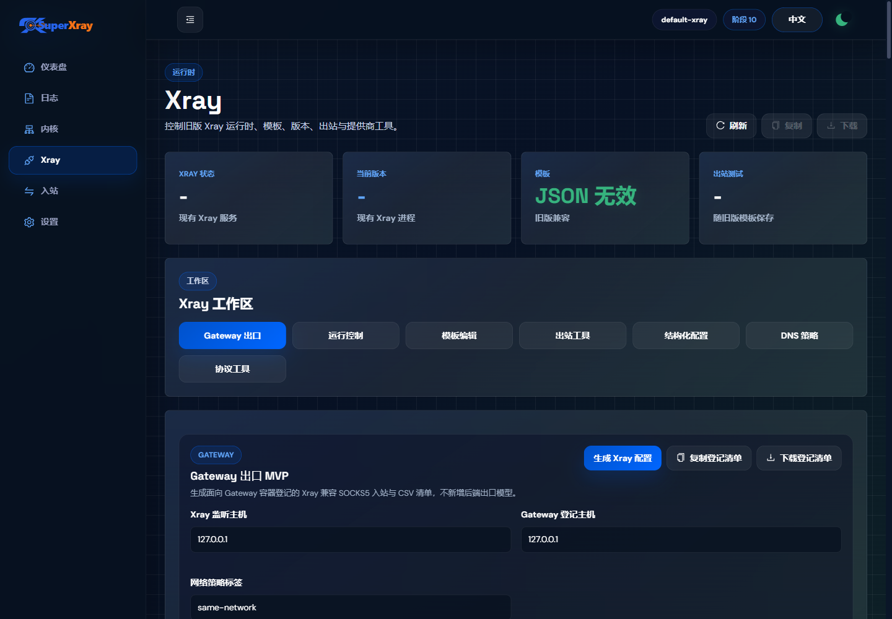
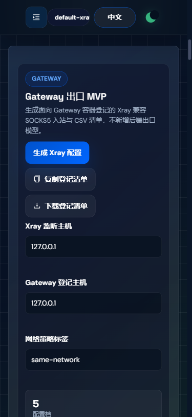

# 前端 UI/UX 全量审计与优化指南

审计日期：2026-05-02
审计范围：登录页、系统状态、入站列表、面板设置、Xray 设置。
测试方式：本地启动面板，使用 Playwright 在 1440x900、390x844 视口执行视觉检查、可访问性快照、DOM 尺寸取证与截图。
参考基线：WCAG 2.2 AA。W3C 当前发布页显示 [WCAG 2.2](https://www.w3.org/TR/WCAG22/) 是 Recommendation，最新发布版本为 2024-12-12；[WAI 概览](https://www.w3.org/WAI/standards-guidelines/wcag/)说明 WCAG 2.2 由可感知、可操作、可理解、健壮四类原则组织。

## 2026-05-16 新 UI 增量审计结论

审计范围：Vue 3 新 UI 的 Xray 页面、入站页顶部动作区、全局 Header、移动端抽屉导航与触控目标。

参考视觉：继续沿用 digital-banking 风格基线，主色为深海军蓝背景、银行蓝主操作、绿色仅用于成功状态，字体为 Space Grotesk + DM Sans，组件半径保持 8px 运维控制台密度。

最新截图：





### 已修复问题

- **P1：Xray 页信息架构过长，Gateway MVP 入口过深。** 已在 Xray 页顶部新增工作区导航，并将 Gateway 出口 MVP 面板前置到模板编辑器之前，用户无需滚动到配置长表后段即可生成 Xray 兼容入站和 Gateway CSV。
- **P1：中文界面混入裸英文。** Inbounds 的“更多操作”、Xray 工作区、Gateway 操作按钮、`listenHost` / `manifestHost` 字段、首屏状态卡与 Gateway 预览标签已改为显式 i18n 文案。
- **P1：Header 视觉 token 被 Ant 默认样式覆盖。** `.app-header.ant-layout-header` 现在强制使用 `rgba(6, 17, 31, 0.84)` 玻璃背景，避免回退到 Ant 默认 `#001529`。
- **P1：移动端焦点与触控细节不足。** 移动抽屉加入显式关闭按钮，打开后焦点自动落到“关闭导航”；工作区导航按钮、抽屉关闭按钮、开关与复选框补齐稳定触控尺寸。
- **P2：源码测试仍鼓励裸英文文案。** 相关断言已改为检查 i18n key，避免未来回归时把英文硬塞回中文界面。

### 浏览器取证

- 1440px：Header computed background 为 `rgba(6, 17, 31, 0.84)`；Gateway MVP DOM 顺序位于模板编辑器之前。
- 375px：页面无横向溢出；工作区导航按钮宽度约 296px、高度 44px；抽屉关闭按钮尺寸 44x44，打开后 `document.activeElement` 为关闭按钮，aria-label 为“关闭导航”。
- Gateway MVP：默认策略仍展示 `listenHost=127.0.0.1`、`manifestHost=127.0.0.1`；生产 Docker bridge 场景应先改为 Gateway 容器可达的 `manifestHost`，再导入 CSV。

### 保留边界

- 本轮只改前端 UI、前端测试、文档和构建产物。
- MVP 仍只通过现有 Xray 模板保存路径落地，不新增 `egress_*` 数据库表，不新增 `/panel/api/egress/*`，不接管 CoreManager，不触碰 sing-box 生产路径。

## 已完成的高优先级修复

### P0：系统状态桌面端关键指标被折叠面板覆盖

现象：桌面端系统状态页中，CPU、内存、网络、Xray 等首屏指标存在于 DOM 中，但第三层“系统负载 & 系统正常运行时间”折叠面板没有独占栅格行，覆盖在首屏指标上方，导致用户实际看到的是一整块空白卡片。

影响：破坏首屏信息架构，F 型扫描路径中最重要的第一行指标不可见；同时阻断点击和视觉理解，是严重可用性问题。

已修复：在 [web/html/index.html](../web/html/index.html#L240) 将第三层折叠区改为 `<a-col :span="24">`，让其独占完整行，避免覆盖前两层指标。

### P0：Ant Design Vue 仪表盘宽度传参错误

现象：`a-progress type="dashboard"` 使用 `width="110"` / `width="80"` 字符串属性，运行时进度环容器宽度为 0，桌面与移动端均无法正确显示 CPU、内存、交换分区、存储进度。

影响：核心监控信息只剩标签，图形反馈失效；移动端首屏尤其明显。

已修复：在 [web/html/index.html](../web/html/index.html#L70)、[web/html/index.html](../web/html/index.html#L91)、[web/html/index.html](../web/html/index.html#L181)、[web/html/index.html](../web/html/index.html#L186) 改为数字绑定 `:width="110"` / `:width="80"`。

验证结果：修复后桌面端首个进度环尺寸为 110x110，第三层折叠面板下移到指标区之后；移动端无横向溢出，仪表盘恢复显示。

## 分级诊断

### P1：深色主题主色文本对比度不足

证据：当前 CSS 中存在 `--color-primary-100: #008771`、`--color-primary-accessible: #006b50`、深色背景 `#151f31` / `#222d42` 等变量。实测对比度：

- `#008771` on `#151f31`：3.70:1，不满足普通文本 4.5:1。
- `#008771` on `#222d42`：3.09:1，不满足普通文本 4.5:1。
- `#006b50` on `#151f31`：2.53:1，更低。
- `#11b99d` on `#151f31`：6.64:1，可作为深色主题文本主色。

影响：标签页激活态、链接、部分状态文本在深色背景下可辨性不足，低视力用户和低亮度屏幕环境下问题明显。

建议：

```css
:root {
  --color-primary-100: #008771;
  --color-primary-on-dark: #11b99d;
  --color-primary-on-dark-strong: #3ad3ba;
}

.dark .ant-tabs-nav .ant-tabs-tab-active,
.dark .ant-tabs-nav .ant-tabs-tab:hover,
.dark .ant-table-tbody a,
.dark .ant-btn-link {
  color: var(--color-primary-on-dark);
}

.dark .ant-tabs-ink-bar {
  background-color: var(--color-primary-on-dark);
}
```

预期体验：深色模式下激活态不再“发暗”，导航和链接可读性达到 WCAG AA。

### P1：Xray/设置页移动端标签导航可发现性弱

证据：Xray 页有 8 个一级标签，移动端横向滚动条在标签下方裸露，后续标签在首屏外；代码位于 [web/html/xray.html](../web/html/xray.html#L74)。公共样式在 [web/html/common/page.html](../web/html/common/page.html#L36) 为标签容器启用了横向滚动，但没有提供当前页数、更多菜单或渐隐提示。

影响：移动端用户很难发现“DNS / Protocol Tools / 高级配置”等后段入口；横向滚动条占据视觉注意力，降低专业感。

建议：

```html
<a-select
  v-if="isMobile"
  v-model="activeXrayTab"
  class="mobile-tab-select"
  @change="changePage">
  <a-select-option value="tpl-basic">基础配置</a-select-option>
  <a-select-option value="tpl-routing">路由规则</a-select-option>
  <a-select-option value="tpl-outbound">出站规则</a-select-option>
  <a-select-option value="tpl-advanced">高级配置</a-select-option>
</a-select>

<a-tabs v-else class="page-tabs" :active-key="activeXrayTab" @change="changePage">
  ...
</a-tabs>
```

```css
@media (max-width: 576px) {
  .mobile-tab-select {
    width: 100%;
    margin: 8px 0 12px;
  }
}
```

预期体验：移动端从“横向找标签”变成“下拉选择模块”，路径更明确，尤其适合配置项很多的运维页面。

### P1：移动端安全警报占用过高首屏面积

证据：登录后多数页面顶部均显示 TLS 安全警报；移动端 390px 宽度下，警报高度约 103px，并与左侧抽屉 handle 的纵向区域竞争。

影响：首屏有效内容被明显挤压。对于已经知道风险的管理员，重复警报会形成提示疲劳。

建议：

```html
<a-alert
  v-if="showAlert && loadingStates.fetched"
  banner
  closable
  :after-close="rememberSecurityAlertDismissed"
  class="security-alert">
</a-alert>
```

```js
rememberSecurityAlertDismissed() {
  localStorage.setItem('security-alert-dismissed-at', String(Date.now()));
}
```

```css
@media (max-width: 576px) {
  .security-alert .ant-alert-description {
    display: -webkit-box;
    -webkit-line-clamp: 2;
    -webkit-box-orient: vertical;
    overflow: hidden;
  }
}
```

预期体验：风险仍可见，但不压垮移动端首屏；关闭后可按天或按配置变化重新提醒。

### P2：移动端入站页存在重复主操作

证据：入站页移动端工具栏保留“添加”图标按钮，同时页面右下角还有 `mobile-fab`，相关模板在 [web/html/inbounds.html](../web/html/inbounds.html#L130) 与 [web/html/inbounds.html](../web/html/inbounds.html#L874)。

影响：两个入口执行同一动作，增加选择成本，也容易遮挡表格底部内容。

建议：移动端只保留 FAB 作为新增入口，工具栏中隐藏添加按钮；桌面端保留显式文字按钮。

```html
<a-button v-if="!isMobile" type="primary" icon="plus" @click="openAddInbound">
  添加入站 / Add Inbound
</a-button>
```

预期体验：移动端工具栏聚焦刷新、筛选和批量操作；新增动作始终位于拇指热区。

### P2：表格在空数据状态下缺少下一步引导

证据：入站表格空状态只显示“无数据。”，首屏虽然有添加按钮，但空表区域没有将用户引导回主要动作。

影响：新安装用户的首个任务路径不够明确。

建议：

```html
<a-empty v-if="dbInbounds.length === 0" description="暂无入站">
  <a-button type="primary" icon="plus" @click="openAddInbound">添加入站</a-button>
</a-empty>
```

预期体验：空状态从“没有东西”变成“下一步做什么”，降低首次配置摩擦。

### P2：页面动作区使用 sticky 后需要统一阴影与层级

证据：`.page-action-card` 使用 `position: sticky; top: 12px; z-index: 6`，见 `web/assets/css/custom.min.css` 的追加样式块。设置页、Xray 页首屏表现稳定，但移动端会与警报、标签区形成多个高层级块。

建议：sticky 仅在滚动后加阴影；首屏保持轻量。

```css
.page-action-card {
  position: sticky;
  top: 12px;
  z-index: 6;
  box-shadow: none;
}

.page-action-card.is-stuck {
  box-shadow: 0 8px 24px rgb(0 0 0 / .22);
}
```

预期体验：动作区保持可达，不会在首屏显得“压住”内容。

## 信息架构与视线流动

系统状态页适合 F 型扫描：左侧导航提供垂直定位，主内容从上到下依次是安全风险、核心指标、次级指标、低频详情。修复后首屏路径更合理：用户先看 CPU/内存，再看网络和 Xray 状态，最后看 IP、TCP/UDP 和管理动作。

登录页更接近 Z 型布局：中心卡片承载标题、账号、密码和主按钮，背景波浪作为视觉锚点。当前登录页任务聚焦较好，需继续保持按钮和输入框的强对比，避免添加过多说明文本。

设置页和 Xray 页属于配置工作台，应采用“顶部动作 + 模块标签 + 分组表单”的扫描路径。现有方向正确，但移动端标签过多时应降级为选择器或目录抽屉。

## 组件一致性建议

- 统一主操作：桌面使用文字按钮，移动端同类新增动作使用 FAB，避免同一视口内重复。
- 统一危险操作：危险按钮使用红色实体按钮并配确认弹窗；普通重启/停止建议保持图标+文字。
- 统一表单密度：设置页表单当前桌面密度较好，移动端应保持 44px 控件高度，标签与说明上下排列。
- 统一空状态：所有表格空状态应带下一步动作。
- 统一可访问名称：图标按钮继续补齐 `aria-label`，尤其刷新、下拉、抽屉、历史图标。

## 后续实施路线

1. P0 已完成：修复系统状态首屏覆盖与仪表盘宽度。
2. P1：调整深色主题主色文本 token，保证导航、链接、标签页激活态达到 4.5:1。
3. P1：Xray/设置移动端标签改为移动专用选择器或“更多”菜单。
4. P1：安全警报支持持久关闭与移动端两行截断。
5. P2：入站空状态和移动端重复新增入口收敛。
6. P2：为关键页面补一组 Playwright 视觉回归断言：桌面 1440x900、平板 768x1024、手机 390x844，至少断言无横向溢出、核心卡片可见、主要按钮可见、表格容器不溢出。

## 建议的视觉回归断言

```js
await expect(page.locator('.dashboard-primary-card').first()).toBeVisible();
await expect(page.locator('.dashboard-primary-card .ant-progress').first()).toHaveJSProperty('offsetWidth', 110);
await expect(page.locator('.ant-collapse').first()).toBeBelow(page.locator('.dashboard-secondary-card').first());
expect(await page.evaluate(() => document.documentElement.scrollWidth <= document.documentElement.clientWidth)).toBe(true);
```

注：最后一条伪代码中的 `toBeBelow` 需要封装为读取 `getBoundingClientRect()` 的自定义断言。
